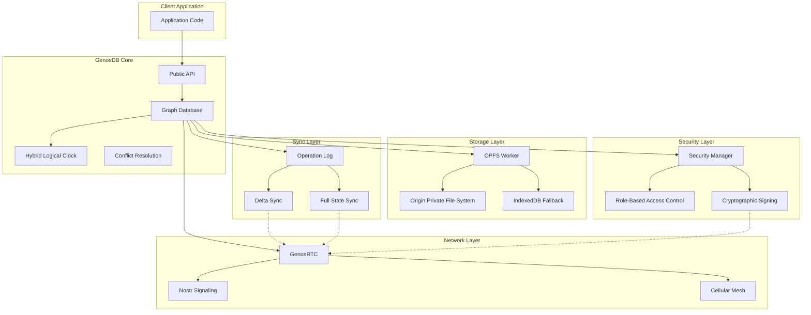

GenosDB is a distributed, peer-to-peer graph database built with a modular, layered architecture designed for performance, security, and scalability. This page provides a high-level overview of the system's components and how they work together.

## Core Components

<CardGroup cols={2}>
  <Card title="Storage Layer" icon="database" href="/advanced/worker-architecture">
    High-performance OPFS worker with tiered fallback
  </Card>
  <Card title="Sync Engine" icon="arrows-rotate" href="/advanced/hybrid-delta-protocol">
    Intelligent hybrid delta and full-state synchronization
  </Card>
  <Card title="Security Manager" icon="shield-halved" href="/advanced/security/rbac">
    Zero-trust RBAC with cryptographic identity
  </Card>
  <Card title="P2P Network" icon="network-wired" href="/advanced/p2p/genosrtc-architecture">
    WebRTC mesh with Nostr signaling
  </Card>
</CardGroup>

## System Architecture



## Data Flow

### Write Operations

When you write data to GenosDB, the following happens:

1. **Application Layer**: Call `db.put(data)`
2. **Security Check**: If Security Manager is enabled, verify user has write permission
3. **Timestamp Generation**: Hybrid Logical Clock assigns a causal timestamp
4. **Local Write**: Data is written to in-memory graph with timestamp
5. **Operation Logging**: Write operation is appended to the OpLog
6. **Persistence**: OPFS Worker saves the graph state to disk (debounced)
7. **Network Broadcast**: If RTC enabled, operation is signed and broadcast to peers
8. **Peer Reception**: Remote peers verify signature, check permissions, and apply via CRDT conflict resolution

```javascript
// Example write with full data flow
const db = await gdb('mydb', { 
  rtc: true,
  sm: { superAdmins: ['0x...'] }
});

// This triggers the entire flow described above
const id = await db.put({ 
  title: 'Hello World',
  timestamp: Date.now()
});
```

<Info>
  The OPFS Worker runs on a separate thread, ensuring write operations never block the UI.
</Info>

### Read Operations

Reads are optimized for speed:

1. **Query Parsing**: Parse query parameters and filters
2. **In-Memory Lookup**: Retrieve data directly from the in-memory graph
3. **Index Utilization**: Use radix tree indexes if available for fast filtering
4. **Graph Traversal**: For `$edge` queries, recursively traverse relationships
5. **Permission Filtering**: If ACLs enabled, filter nodes based on user permissions
6. **Return Results**: Stream results to the callback or return promise

```javascript
// Fast in-memory reads
const { result } = await db.get('node-id');

// Reactive subscriptions
const { unsubscribe } = await db.map(({ id, value }) => {
  console.log('Node updated:', id, value);
}, {
  query: { status: 'active' },
  order: 'desc',
  field: 'timestamp'
});
```

### Synchronization Flow

<Steps>
  <Step title="Peer Connection">
    New peer connects to the network via Nostr relays and establishes WebRTC connections
  </Step>
  <Step title="Sync Handshake">
    Peer sends its last known timestamp (`globalTimestamp`) to others
  </Step>
  <Step title="Delta Calculation">
    If timestamp is recent, receiving peer calculates delta from OpLog and sends compressed operations
  </Step>
  <Step title="Fallback Detection">
    If timestamp is too old or null, full state sync is triggered
  </Step>
  <Step title="Conflict Resolution">
    All incoming operations pass through HLC-based Last-Write-Wins resolution
  </Step>
  <Step title="State Convergence">
    Peer's local state converges with the network, achieving eventual consistency
  </Step>
</Steps>

## Key Design Principles

### 1. **Local-First Architecture**

GenosDB prioritizes local performance:

- All reads from in-memory graph (microsecond latency)
- Writes are synchronous to memory, asynchronous to disk
- Network sync happens in the background
- Works fully offline with automatic sync on reconnection

### 2. **Eventual Consistency**

Using CRDTs and hybrid logical clocks:

- All peers converge to the same state eventually
- Conflicts are resolved deterministically using Last-Write-Wins
- No central coordinator needed
- Network partitions are handled gracefully

### 3. **Zero-Trust Security**

Every operation is verified:

- Cryptographic signatures prove authenticity
- Role-based permissions enforce authorization
- No operation is trusted by default
- Security rules are embedded in the graph itself

### 4. **Modular Extension**

Core remains lightweight:

- Optional modules (SM, ACLs, Geo, NLQ) load on demand
- Dynamic imports reduce initial bundle size
- Custom modules can extend functionality
- Clean API boundaries between layers

## Performance Characteristics

| Operation | Latency | Throughput |
|-----------|---------|------------|
| In-memory read | ~10μs | Millions/sec |
| In-memory write | ~50μs | 50,000+/sec |
| OPFS persistence | ~5ms (debounced) | Batch writes |
| Local tab sync | ~1ms | Near-instant |
| P2P delta sync | ~50-200ms | Network-dependent |
| Full state sync | ~500ms-2s | Size-dependent |

<Note>
  Performance varies based on data size, network conditions, and hardware capabilities.
</Note>

## Scalability

### Data Scale

- **Nodes**: Tested with 100K+ nodes per database
- **Graph depth**: Efficient traversal up to 10+ hops with `$edge`
- **Operations/sec**: 50,000+ sustained writes without UI blocking

### Network Scale

- **Traditional Mesh**: Recommended for < 100 peers
- **Cellular Mesh**: Scales to 10,000+ peers with O(N) connection complexity
- **Cross-tab sync**: Unlimited tabs via BroadcastChannel

## Related Pages

<CardGroup cols={2}>
  <Card title="Worker Architecture" icon="gears" href="/advanced/worker-architecture">
    Deep dive into the persistence layer
  </Card>
  <Card title="Hybrid Delta Protocol" icon="code-merge" href="/advanced/hybrid-delta-protocol">
    How synchronization works
  </Card>
  <Card title="Hybrid Logical Clock" icon="clock" href="/advanced/hybrid-logical-clock">
    Conflict resolution internals
  </Card>
  <Card title="GenosRTC Architecture" icon="satellite-dish" href="/advanced/p2p/genosrtc-architecture">
    P2P networking layer
  </Card>
</CardGroup>
