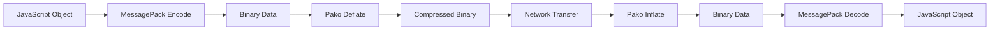

GenosDB's synchronization protocol is designed to handle the reality of distributed networks where peers can have vastly different states. The engine intelligently switches between high-efficiency delta updates and guaranteed full-state fallback to ensure eventual consistency with optimal performance.

<iframe width="100%" height="400" src="https://www.youtube.com/embed/wN1Ee7fsKJg" title="GenosDB: Hybrid Sync and Zero-Trust Security Architecture" frameborder="0" allow="accelerometer; autoplay; clipboard-write; encrypted-media; gyroscope; picture-in-picture" allowfullscreen></iframe>

## Overview

The Hybrid Delta Protocol is a two-mode synchronization engine:

1. **Delta Sync** (Primary): Transmits only changes since last sync
2. **Full-State Sync** (Fallback): Sends entire graph when needed

This architecture ensures:
- **Efficiency**: Minimal bandwidth for frequent updates
- **Reliability**: Guaranteed consistency even after long offline periods
- **Performance**: Compressed payloads for fast transmission

## High-Efficiency Delta Sync

For peers that are frequently communicating, transmitting the entire graph for minor changes is inefficient. GenosDB's primary synchronization method is based on **delta updates**, powered by a persistent, local **Operation Log (Oplog)**.

### The Process, Step-by-Step

<Steps>
  <Step title="Operation Logging (Oplog)">
    Every local mutation (`put`, `remove`, `link`) is recorded as an entry in a capped, sliding-window log persisted in `localStorage`. Each entry contains:
    
    - Operation `type` (upsert, remove, link)
    - Affected node `id`
    - Precise **Hybrid Logical Clock (HLC)** `timestamp`
    
    ```javascript
    // Example oplog entry
    {
      type: 'upsert',
      id: 'node-123',
      timestamp: { physical: 1709582400000, logical: 5 }
    }
    ```
  </Step>
  
  <Step title="Sync Handshake">
    When a peer connects or wants to catch up, it broadcasts a `sync` request containing:
    
    - The HLC timestamp of the last operation it processed (`globalTimestamp`)
    - A brand-new peer sends `globalTimestamp: null`
    
    ```javascript
    // Sync request message
    {
      type: 'sync',
      globalTimestamp: { physical: 1709582000000, logical: 12 }
    }
    ```
  </Step>
  
  <Step title="Delta Calculation & Hydration">
    Upon receiving a `sync` request, the peer:
    
    1. Filters its Oplog for all operations with `timestamp > globalTimestamp`
    2. **Hydrates** any `upsert` operations by fetching the full current `value` from the graph
    3. Creates a self-contained array of complete operations
    
    ```javascript
    // Hydrated delta operations
    const delta = oplog
      .filter(op => op.timestamp > globalTimestamp)
      .map(op => {
        if (op.type === 'upsert') {
          return {
            ...op,
            value: graph.get(op.id).value // Full current value
          };
        }
        return op;
      });
    ```
  </Step>
  
  <Step title="Minimal & Compressed Transfer">
    The delta array is:
    
    1. Serialized using **MessagePack** (binary format)
    2. Compressed with **pako (deflate)**
    3. Sent to the requesting peer in a `deltaSync` message
    
    This minimal binary payload dramatically reduces bandwidth.
  </Step>
  
  <Step title="Efficient Application">
    The receiving peer:
    
    1. Decompresses the payload
    2. Deserializes from MessagePack
    3. Applies the batch of operations via conflict resolution
    4. Updates its `globalTimestamp` to the highest received
    
    The graph state is now up to date with minimal processing overhead.
  </Step>
</Steps>

### Performance Benefits

<Card title="Bandwidth Reduction" icon="chart-line">
  Delta sync can reduce network traffic by **90-99%** compared to full-state sync for active peers with frequent small changes.
</Card>

**Example comparison:**

| Scenario | Full State | Delta Sync | Savings |
|----------|-----------|------------|--------|
| 10 new messages | 500 KB | 5 KB | 99% |
| 100 updates | 500 KB | 50 KB | 90% |
| 1 node change | 500 KB | 0.5 KB | 99.9% |

## Guaranteed Consistency Fallback

A delta update is only possible if a peer's history overlaps with the Oplog of its peers. GenosDB's engine gracefully handles scenarios where this is not the case by automatically triggering a **Full-State Fallback**.

### Fallback Triggers

Full-state sync is initiated under two specific conditions:

<AccordionGroup>
  <Accordion title="1. Peer Too Far Behind">
    A peer receives a `sync` request with a `globalTimestamp` that is **older than the oldest operation** in its Oplog.
    
    ```javascript
    // Oplog only keeps last 1000 operations
    const oldestOplogTimestamp = oplog[0].timestamp;
    
    if (requestTimestamp < oldestOplogTimestamp) {
      // Peer is too far behind, send full state
      triggerFullStateSync();
    }
    ```
    
    This happens when a peer has been offline longer than the oplog window.
  </Accordion>
  
  <Accordion title="2. New Peer Joining">
    A peer receives a `sync` request from a new peer where `globalTimestamp` is `null`.
    
    ```javascript
    if (requestTimestamp === null) {
      // Brand new peer, send full state
      triggerFullStateSync();
    }
    ```
    
    This ensures new peers receive the complete current state immediately.
  </Accordion>
</AccordionGroup>

### The Fallback Process

<Steps>
  <Step title="Full-State Transmission">
    Instead of a delta, the up-to-date peer:
    
    1. Serializes its **entire current graph state** (all nodes and relationships)
    2. Compresses with pako
    3. Sends in a `syncReceive` message
    
    ```javascript
    const fullState = {
      graph: serialize(this.graph), // All nodes
      timestamp: this.hybridClock.now() // Current clock
    };
    
    const compressed = pako.deflate(msgpack.encode(fullState));
    syncChannel.send({ type: 'syncReceive', data: compressed });
    ```
  </Step>
  
  <Step title="State Reconciliation & Reset">
    The desynchronized peer receives the full graph and performs critical reconciliation:
    
    1. **Discards** its outdated local graph state
    2. **Replaces** with the new graph
    3. **Clears** its own Oplog (previous history is invalid)
    4. Scans the new graph to find the **highest HLC timestamp**
    5. **Fast-forwards** its HybridClock to this timestamp
    6. Sets `globalTimestamp` to this value
    
    ```javascript
    // Reconciliation logic
    this.graph = deserialize(receivedGraph);
    this.oplog.clear();
    
    const maxTimestamp = findMaxTimestamp(this.graph);
    this.hybridClock.update(maxTimestamp);
    this.globalTimestamp = maxTimestamp;
    ```
    
    This ensures the peer is correctly positioned in time and can immediately participate in future delta syncs.
  </Step>
</Steps>

<Warning>
  Full-state sync is more expensive but guarantees **absolute consistency**. The hybrid approach ensures it only happens when necessary.
</Warning>

## Operation Log (Oplog) Architecture

The Oplog is a critical component that makes delta sync possible.

### Configuration

```javascript
const db = await gdb('mydb', {
  rtc: true,
  oplogSize: 1000  // Keep last 1000 operations (default)
});
```

### Characteristics

- **Capped Size**: Circular buffer, keeps most recent N operations
- **Persistent**: Stored in `localStorage` to survive page refreshes
- **Sliding Window**: Automatically evicts oldest operations when full
- **Timestamp Indexed**: Fast filtering by HLC timestamp

### Structure

```javascript
// Oplog entry format
{
  type: 'upsert' | 'remove' | 'link',
  id: string,              // Node ID
  timestamp: {
    physical: number,      // Wall clock time
    logical: number        // Logical counter
  },
  // Additional metadata for specific operations
}
```

### Limitations

The oplog window size determines how long a peer can be offline before requiring full-state sync:

| Oplog Size | Avg Updates/Min | Offline Window |
|-----------|----------------|----------------|
| 100 | 10 | ~10 minutes |
| 1,000 (default) | 10 | ~100 minutes |
| 10,000 | 10 | ~16 hours |
| 1,000 | 100 | ~10 minutes |

<Info>
  Configure `oplogSize` based on your application's update frequency and expected offline periods.
</Info>

## Compression and Serialization

Both delta and full-state sync use the same compression pipeline:



### Compression Ratios

Typical compression ratios:

- **Text-heavy data**: 70-85% reduction
- **JSON with many keys**: 60-75% reduction
- **Binary data**: 10-30% reduction
- **Already compressed**: Minimal reduction

```javascript
// Example compression
const data = { /* 100KB of graph data */ };
const encoded = msgpack.encode(data);      // ~85KB (binary)
const compressed = pako.deflate(encoded);  // ~20KB (compressed)

// 80% reduction from original
```

## Security Integration

When the Security Manager is enabled, synchronization containers are signed:

```javascript
// Signed container for delta sync
{
  type: 'deltaSync',
  operations: [ /* delta operations */ ],
  signature: '0x...',           // Cryptographic signature
  originEthAddress: '0x...'     // Sender's address
}
```

Receiving peers:

1. **Verify signature** before processing
2. **Check permissions** for each operation
3. **Filter out** unauthorized operations
4. **Apply** only verified changes

<Card title="Zero-Trust Sync" icon="shield-check">
  Even in full-state sync, every node's `lastModifiedBy` is verified against RBAC rules, ensuring no invalid data propagates.
</Card>

## Synchronization Logs

In development, GenosDB provides clear sync logs:

```bash
🚀 [DELTA SYNC SENDING] Found 47 new operations to send.
⚡ [DELTA SYNC RECEIVED] Applied 47 operations from peer-abc.
💥 [FALLBACK TRIGGERED] Peer is too far behind. Sending FULL state.
🔄 [FULL STATE RECEIVED] Replaced local graph with 1,234 nodes.
```

These help you understand sync behavior during debugging.

## Best Practices

<AccordionGroup>
  <Accordion title="Configure Oplog Size Appropriately">
    - Higher `oplogSize` = longer offline tolerance but more memory
    - Lower `oplogSize` = less memory but more full-state syncs
    - Default (1000) works well for most applications
  </Accordion>
  
  <Accordion title="Monitor Sync Patterns">
    - Frequent full-state syncs indicate peers going offline too long
    - Consider increasing `oplogSize` or implementing wake-on-network
    - Use the cellular mesh for large peer counts to reduce sync load
  </Accordion>
  
  <Accordion title="Handle Sync Events">
    ```javascript
    db.room.on('peer:join', (peerId) => {
      console.log('New peer joined:', peerId);
      // Expect full-state sync
    });
    ```
  </Accordion>
  
  <Accordion title="Optimize Data Structure">
    - Smaller nodes sync faster
    - Avoid storing large binary blobs in node values
    - Use links to reference external data
  </Accordion>
</AccordionGroup>

## Performance Metrics

Based on real-world testing:

| Metric | Delta Sync | Full State |
|--------|-----------|------------|
| Latency (100 ops) | 50-100ms | 200-500ms |
| Latency (1K ops) | 100-200ms | 500-1500ms |
| Bandwidth (100 nodes) | 5-10 KB | 50-200 KB |
| CPU usage | Very Low | Moderate |
| UI blocking | None | None |

## Related Pages

<CardGroup cols={2}>
  <Card title="Hybrid Logical Clock" icon="clock" href="/advanced/hybrid-logical-clock">
    How timestamps enable delta sync
  </Card>
  <Card title="Worker Architecture" icon="gears" href="/advanced/worker-architecture">
    How synced data gets persisted
  </Card>
  <Card title="GenosRTC Architecture" icon="satellite-dish" href="/advanced/p2p/genosrtc-architecture">
    Network layer that transports sync messages
  </Card>
  <Card title="Distributed Trust" icon="handshake" href="/advanced/security/distributed-trust">
    How sync verifies security in a P2P network
  </Card>
</CardGroup>
