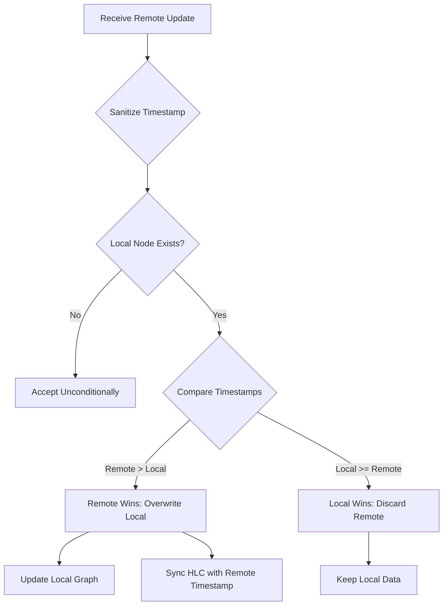

The Hybrid Logical Clock (HLC) is the foundation of GenosDB's conflict resolution system. It provides causally-ordered, monotonic timestamps for all operations, ensuring that conflict resolution is deterministic, reliable, and immune to physical clock desynchronization.


## Overview

GenosDB uses a **Last-Write-Wins (LWW)** CRDT strategy enhanced by Hybrid Logical Clocks. This combination provides:

- **Causal Ordering**: Operations are ordered by causality, not just wall-clock time
- **Monotonicity**: Timestamps always move forward, never backward
- **Determinism**: All peers resolve conflicts to the same outcome
- **Clock Skew Tolerance**: Resilient to system clock inaccuracies

## The Hybrid Logical Clock Mechanism

The HLC combines two components to form a unique and ordered timestamp:

<CardGroup cols={2}>
  <Card title="Physical Component" icon="clock">
    Wall-clock time from the system clock, keeping timestamps aligned with real-world time for logging and auditing.
  </Card>
  <Card title="Logical Component" icon="arrow-up-1-9">
    Sequential counter used as a tie-breaker for events occurring in the same millisecond, preserving causal relationships.
  </Card>
</CardGroup>

### Timestamp Structure

```javascript
// HLC timestamp format
{
  physical: 1709582400000,  // Unix timestamp in milliseconds
  logical: 5                // Counter for events in same millisecond
}
```

## Clock Operations

### Local Timestamp Generation

When a new local operation occurs, the HLC generates a timestamp that is strictly greater than any it has previously generated or observed.

```javascript
class HybridClock {
  constructor() {
    this.state = {
      physical: 0,
      logical: 0
    };
  }
  
  now() {
    const wallTime = Date.now();
    
    if (wallTime > this.state.physical) {
      // Physical time advanced, reset logical
      this.state.physical = wallTime;
      this.state.logical = 0;
    } else {
      // Same millisecond, increment logical
      this.state.logical++;
    }
    
    return { ...this.state };
  }
}
```

<Steps>
  <Step title="Read Wall Clock">
    Get current physical time from `Date.now()`
  </Step>
  <Step title="Check Monotonicity">
    If wall time > last physical time, use it and reset logical counter to 0
  </Step>
  <Step title="Handle Same Millisecond">
    If wall time equals last physical time, keep physical and increment logical counter
  </Step>
  <Step title="Prevent Backward Motion">
    If wall time < last physical (clock skew), use last physical and increment logical
  </Step>
</Steps>

### Clock Synchronization with Remote Events

When a node receives data from a peer, it synchronizes its local clock with the remote timestamp.

```javascript
class HybridClock {
  update(remoteTimestamp) {
    const wallTime = Date.now();
    
    // Take maximum of local and remote physical time
    const newPhysical = Math.max(
      wallTime,
      this.state.physical,
      remoteTimestamp.physical
    );
    
    // Update logical component
    if (newPhysical === this.state.physical && 
        newPhysical === remoteTimestamp.physical) {
      // Same millisecond for all three, take max logical + 1
      this.state.logical = Math.max(
        this.state.logical,
        remoteTimestamp.logical
      ) + 1;
    } else if (newPhysical === this.state.physical) {
      // Same as local physical, increment local logical
      this.state.logical++;
    } else if (newPhysical === remoteTimestamp.physical) {
      // Same as remote physical, use remote logical + 1
      this.state.logical = remoteTimestamp.logical + 1;
    } else {
      // Physical time advanced, reset logical
      this.state.logical = 0;
    }
    
    this.state.physical = newPhysical;
  }
}
```

<Info>
  This synchronization protocol ensures the local clock always "learns" from remote events, propagating causal information through the network.
</Info>

## Last-Write-Wins Conflict Resolution

The LWW strategy uses HLC timestamps to deterministically resolve conflicts when concurrent updates occur.

### Timestamp Comparison Logic

When comparing two timestamps to determine which is "later":

```javascript
function compareTimestamps(t1, t2) {
  // 1. Compare physical components first
  if (t1.physical > t2.physical) return 1;   // t1 is later
  if (t1.physical < t2.physical) return -1;  // t2 is later
  
  // 2. Physical components equal, compare logical
  if (t1.logical > t2.logical) return 1;     // t1 is later
  if (t1.logical < t2.logical) return -1;    // t2 is later
  
  return 0;  // Timestamps are identical
}
```

<Steps>
  <Step title="Compare Physical">
    The timestamp with the greater physical value wins
  </Step>
  <Step title="Compare Logical (if tied)">
    If physical values are equal, the timestamp with the greater logical value wins
  </Step>
  <Step title="Deterministic Tie-Breaking">
    If both components are equal, timestamps are identical (very rare)
  </Step>
</Steps>

### Mitigation of Clock Skew and Future Drift

A significant challenge in distributed systems is clock skew, where a node's physical clock is inaccurate.

**Protection Against Future Timestamps**

```javascript
const MAX_DRIFT = 60000; // 60 seconds

function sanitizeTimestamp(timestamp) {
  const now = Date.now();
  const maxAllowed = now + MAX_DRIFT;
  
  if (timestamp.physical > maxAllowed) {
    // Cap physical component to prevent future drift
    return {
      physical: maxAllowed,
      logical: timestamp.logical  // Preserve logical
    };
  }
  
  return timestamp;
}
```

<Warning>
  This safeguard prevents a single misconfigured node from corrupting the temporal ordering of the entire system.
</Warning>

### Resolution Decision Flow

When an incoming update targets data that already exists locally:



**Resolution Logic**

```javascript
function resolveConflict(localNode, remoteNode) {
  // Sanitize incoming timestamp
  const remoteTimestamp = sanitizeTimestamp(remoteNode.timestamp);
  
  // No local version = accept remote
  if (!localNode) {
    return { winner: 'remote', node: remoteNode };
  }
  
  // Compare timestamps
  const comparison = compareTimestamps(
    remoteTimestamp,
    localNode.timestamp
  );
  
  if (comparison > 0) {
    // Remote is later, remote wins
    return { winner: 'remote', node: remoteNode };
  } else {
    // Local is later or equal, local wins
    return { winner: 'local', node: localNode };
  }
}
```

## System Integration and Data Flow

The conflict resolution logic is integrated into the network message processing pipeline.

### Integration Points

<AccordionGroup>
  <Accordion title="1. Local Write Operations">
    ```javascript
    async function put(value) {
      const id = generateId();
      const timestamp = this.hybridClock.now();
      
      const node = {
        id,
        value,
        timestamp,
        lastModifiedBy: this.currentUser
      };
      
      // Write to local graph
      this.graph.set(id, node);
      
      // Log operation
      this.oplog.append({
        type: 'upsert',
        id,
        timestamp
      });
      
      // Broadcast to network
      if (this.rtcEnabled) {
        this.syncChannel.send({
          type: 'operation',
          operation: node
        });
      }
      
      return id;
    }
    ```
  </Accordion>
  
  <Accordion title="2. Remote Update Reception">
    ```javascript
    function handleRemoteUpdate(operation) {
      // Resolve conflict
      const { winner, node } = resolveConflict(
        this.graph.get(operation.id),
        operation
      );
      
      if (winner === 'remote') {
        // Update local graph
        this.graph.set(operation.id, node);
        
        // Sync clock with winning timestamp
        this.hybridClock.update(node.timestamp);
        
        // Trigger reactivity
        this.notifySubscribers(operation.id, node);
      }
      // else: local wins, discard remote
    }
    ```
  </Accordion>
  
  <Accordion title="3. Full-State Sync">
    ```javascript
    function applyFullState(remoteGraph) {
      for (const [id, remoteNode] of remoteGraph) {
        const { winner, node } = resolveConflict(
          this.graph.get(id),
          remoteNode
        );
        
        if (winner === 'remote') {
          this.graph.set(id, node);
          this.hybridClock.update(node.timestamp);
        }
      }
      
      // Update global timestamp to max seen
      const maxTimestamp = findMaxTimestamp(this.graph);
      this.globalTimestamp = maxTimestamp;
    }
    ```
  </Accordion>
</AccordionGroup>

<Info>
  After accepting a remote update, the local HLC is synchronized with the winning timestamp. This ensures the local node has "fast-forwarded" its clock, maintaining causal consistency.
</Info>

## Convergence Properties

By following this integrated flow, all peers independently converge toward the same state:

<CardGroup cols={2}>
  <Card title="Eventual Consistency" icon="check-double">
    All peers will eventually agree on the same final value for each node
  </Card>
  <Card title="Deterministic Resolution" icon="gavel">
    The same conflict always resolves the same way on all peers
  </Card>
  <Card title="Causal Preservation" icon="timeline">
    If operation A causally precedes B, A's timestamp < B's timestamp
  </Card>
  <Card title="No Coordination" icon="arrows-split-up-and-left">
    Each peer makes decisions independently without consensus protocol
  </Card>
</CardGroup>

## Example Scenarios

### Scenario 1: Concurrent Updates

```javascript
// Peer A (physical: 1000)
db.put({ id: 'task-1', text: 'Buy milk' });
// Timestamp: { physical: 1000, logical: 0 }

// Peer B (physical: 1000, same millisecond!)
db.put({ id: 'task-1', text: 'Buy eggs' });
// Timestamp: { physical: 1000, logical: 0 }

// When they sync:
// Both have same physical time, but B's update came slightly after
// B's logical counter would be incremented on sync
// Final result: { physical: 1000, logical: 1 } -> "Buy eggs" wins
```

### Scenario 2: Clock Skew

```javascript
// Peer A (system clock: 1000)
db.put({ id: 'note', text: 'Draft' });
// Timestamp: { physical: 1000, logical: 0 }

// Peer B (system clock: 500, running slow!)
db.put({ id: 'note', text: 'Final' });
// Timestamp: { physical: 500, logical: 0 }

// When they sync:
// A's timestamp (1000,0) > B's timestamp (500,0)
// Result: "Draft" wins despite B's update being newer in real time
// This is correct: HLC provides causal ordering, not real-time ordering
```

### Scenario 3: Sequential Updates

```javascript
// Peer A
const id1 = await db.put({ text: 'First' });
// { physical: 1000, logical: 0 }

const id2 = await db.put({ text: 'Second' });
// { physical: 1000, logical: 1 }  // Same millisecond

const id3 = await db.put({ text: 'Third' });
// { physical: 1001, logical: 0 }  // Next millisecond

// Timestamps preserve causal order: id1 < id2 < id3
```

## Performance Characteristics

| Operation | Time Complexity | Space Complexity |
|-----------|----------------|------------------|
| Generate timestamp | O(1) | O(1) |
| Compare timestamps | O(1) | O(1) |
| Update from remote | O(1) | O(1) |
| Sanitize timestamp | O(1) | O(1) |

HLC operations are extremely lightweight and add negligible overhead to database operations.

## Best Practices

<AccordionGroup>
  <Accordion title="Keep System Clocks Roughly Synchronized">
    While HLC tolerates clock skew, extreme differences (hours/days) can cause unexpected LWW outcomes. Use NTP or similar time synchronization on devices when possible.
  </Accordion>
  
  <Accordion title="Don't Rely on Physical Time for Ordering">
    HLC provides **causal** ordering, not real-world time ordering. Don't assume timestamp.physical reflects actual creation time for sorting purposes.
  </Accordion>
  
  <Accordion title="Monitor for Future Drift">
    If you see many sanitized timestamps in logs, investigate system clock configuration on clients.
  </Accordion>
  
  <Accordion title="Understand LWW Semantics">
    Last-Write-Wins means some updates may be discarded. Design your data model accordingly (e.g., use append-only patterns for critical data).
  </Accordion>
</AccordionGroup>

## Related Pages

<CardGroup cols={2}>
  <Card title="Hybrid Delta Protocol" icon="code-merge" href="/advanced/hybrid-delta-protocol">
    How HLC timestamps enable efficient delta sync
  </Card>
  <Card title="Architecture Overview" icon="sitemap" href="/advanced/architecture-overview">
    See how HLC fits into the overall system
  </Card>
</CardGroup>
