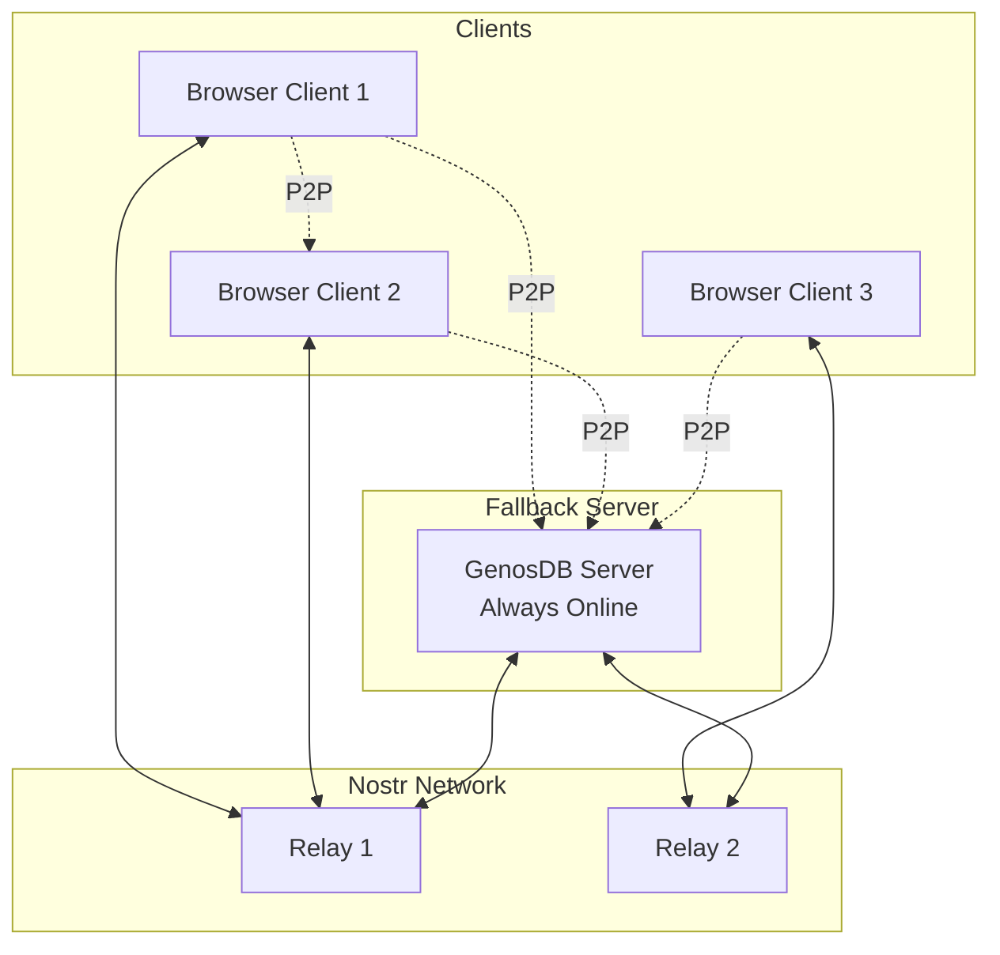

GenosDB is designed to run **without servers by default**. The **Fallback Server** is an optional Node.js service that acts as a superpeer to improve resilience in specific scenarios.

## When to Use

<CardGroup cols={3}>
  <Card title="Limited Uptime" icon="clock">
    When peers have sporadic connectivity
  </Card>
  <Card title="Reliable Fallback" icon="shield">
    Need guaranteed availability for critical data
  </Card>
  <Card title="Temporary Coordination" icon="handshake">
    Bootstrap new networks or coordinate during low peer counts
  </Card>
</CardGroup>

## What It Does

The fallback server is **just another peer** in the network. It:

- Stays online 24/7 to ensure data availability
- Participates in P2P sync like any other node
- Stores the graph state for retrieval when offline peers reconnect
- Does **NOT** introduce centralization (peers can sync directly with each other)

<Info>
The fallback server does not control the network or act as a central authority. It simply improves availability for applications where uptime is critical.
</Info>

## Deploy to Heroku (One Click)

The easiest way to run a fallback server:

[](https://www.heroku.com/deploy?template=https://github.com/estebanrfp/gdb-server)

This deploys a pre-configured GenosDB server that:
- Runs on Heroku's free/hobby tier
- Automatically connects to Nostr relays
- Persists graph state to disk (Heroku ephemeral filesystem)
- Provides a simple health check endpoint

## Manual Installation

### Prerequisites

- Node.js 16+
- NPM or Yarn

### Setup

```bash
# Clone the server repository
git clone https://github.com/estebanrfp/gdb-server.git
cd gdb-server

# Install dependencies
npm install

# Configure environment
cp .env.example .env
nano .env
```

### Environment Variables

```env
# Database name (must match client configuration)
DB_NAME=my-app-db

# RTC Configuration
RTC_ENABLED=true

# Custom relay URLs (optional)
RELAY_URLS=wss://relay1.example.com,wss://relay2.example.com

# Server port
PORT=3000

# Security Manager (optional)
SM_ENABLED=false
SUPER_ADMINS=0xAddress1,0xAddress2
```

### Start the Server

```bash
# Development
npm run dev

# Production
npm start
```

### Verify

```bash
curl http://localhost:3000/health
# Response: { "status": "ok", "dbName": "my-app-db", "peers": 3 }
```

## Client Configuration

Clients automatically discover and connect to the fallback server via Nostr relays:

```javascript
// No special configuration needed!
const db = await gdb('my-app-db', {
  rtc: true
});

// Fallback server participates as a regular peer
```

<Note>
As long as the fallback server uses the same `dbName` and connects to the same Nostr relays, clients will discover and sync with it automatically.
</Note>

## Architecture



## Use Cases

### 1. Low Concurrent Users

**Problem**: If only 1-2 users are typically online, they may not overlap and miss each other's updates.

**Solution**: Fallback server is always online to relay updates.

```javascript
// User A writes data at 9 AM
await db.put({ message: 'Good morning' });

// Fallback server receives and stores

// User B connects at 3 PM (User A offline)
// User B syncs with fallback server and gets the message
```

### 2. Mobile Clients

**Problem**: Mobile browsers often close tabs aggressively, breaking P2P connections.

**Solution**: Fallback server maintains state continuity.

### 3. Development and Testing

**Problem**: During development, reloading the page frequently disrupts P2P connections.

**Solution**: Fallback server provides stable peer for testing.

## Scaling Considerations

<AccordionGroup>
  <Accordion title="Single Server Limitations">
    One fallback server can handle:
    - **100-500 concurrent connections** (depends on server specs)
    - **Moderate data throughput** (MessagePack + compression helps)
    - **Disk space** for graph persistence
    
    For larger deployments, consider:
    - Multiple fallback servers in different regions
    - Load balancing via multiple Nostr relays
  </Accordion>
  
  <Accordion title="High Availability">
    Deploy multiple fallback servers:
    
    ```javascript
    // Server 1 (US East)
    DB_NAME=my-app-db
    RELAY_URLS=wss://relay-us.example.com
    
    // Server 2 (EU West)
    DB_NAME=my-app-db
    RELAY_URLS=wss://relay-eu.example.com
    ```
    
    Clients discover both servers and sync with whichever is reachable.
  </Accordion>
  
  <Accordion title="Data Persistence">
    By default, GenosDB server uses OPFS/IndexedDB (browser-based). For Node.js:
    
    - Stores graph in file system (`./data/my-app-db.bin`)
    - Automatic persistence on updates
    - Consider backing up this file periodically
  </Accordion>
</AccordionGroup>

## Monitoring

Add simple logging to track server health:

```javascript
// server.js
const db = await gdb(process.env.DB_NAME, {
  rtc: true
});

// Log connections
db.room.on('peer:join', (peerId) => {
  console.log(`[${new Date().toISOString()}] Peer joined: ${peerId}`);
  console.log(`Total peers: ${Object.keys(db.room.getPeers()).length}`);
});

db.room.on('peer:leave', (peerId) => {
  console.log(`[${new Date().toISOString()}] Peer left: ${peerId}`);
});

// Health check endpoint
app.get('/health', (req, res) => {
  res.json({
    status: 'ok',
    dbName: process.env.DB_NAME,
    peers: Object.keys(db.room.getPeers()).length,
    uptime: process.uptime()
  });
});
```

## Security

<Warning>
If using Security Manager (RBAC), configure the fallback server with appropriate permissions:

```env
SM_ENABLED=true
SUPER_ADMINS=0xYourAdminAddress
```

The server should have a role that allows reading/writing data but not necessarily assigning roles (unless it needs to act as a superadmin).
</Warning>

## Alternative: Client-Side "Always-On" Peer

Instead of a dedicated server, you can designate a long-running client (e.g., desktop app) as a pseudo-fallback:

```javascript
// Long-running desktop client
const db = await gdb('my-app-db', {
  rtc: { cells: true } // Use cellular mesh for better scalability
});

// Keep running in background
// Acts as stable peer for mobile/browser clients
```

This approach works well for small teams or personal projects.

## Related Pages

<CardGroup cols={2}>
  <Card title="GenosRTC Architecture" icon="satellite-dish" href="/advanced/p2p/genosrtc-architecture">
    P2P networking overview
  </Card>
  <Card title="Nostr Signaling" icon="network-wired" href="/advanced/p2p/nostr-signaling">
    Run your own relay
  </Card>
</CardGroup>
