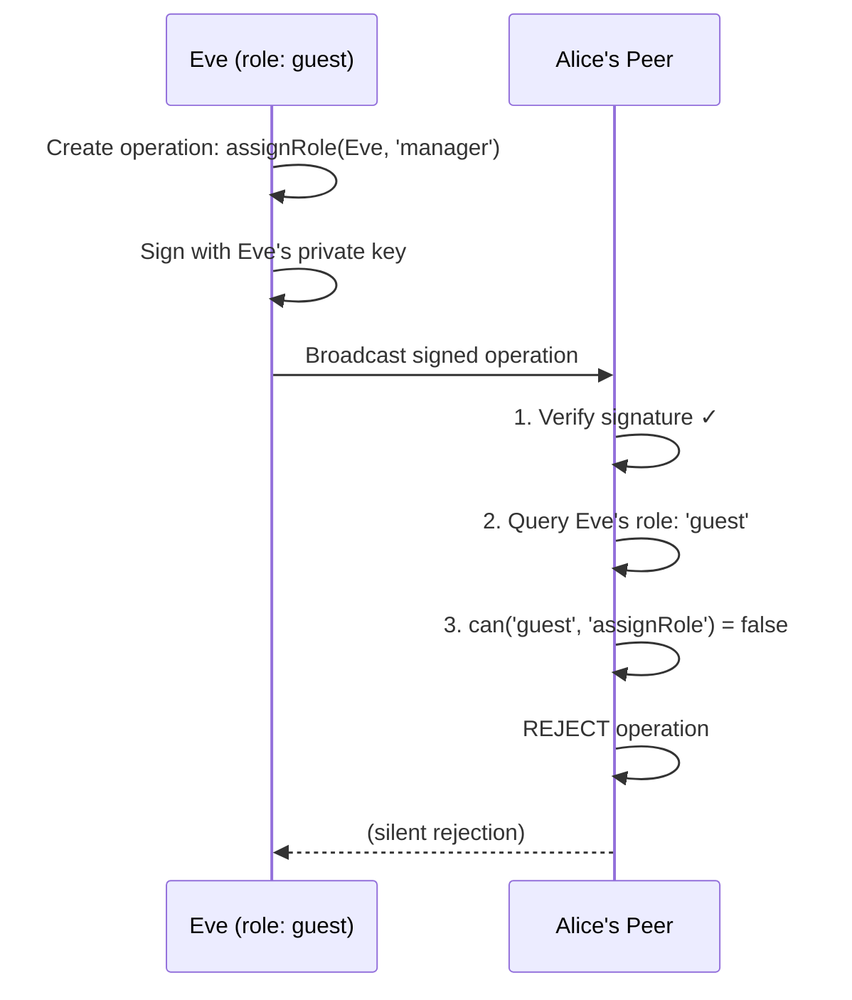
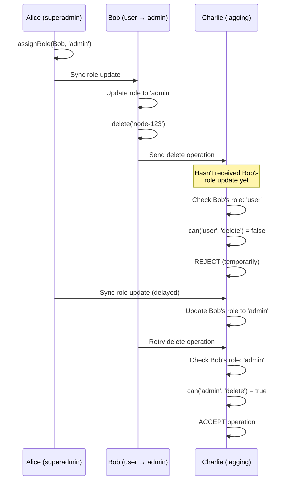

<iframe width="100%" height="400" src="https://www.youtube.com/embed/U79nmK5qUyM" title="GenosDB: Distributed Trust Model" frameborder="0" allow="accelerometer; autoplay; clipboard-write; encrypted-media; gyroscope; picture-in-picture" allowfullscreen></iframe>

## Central Challenge: Distributed Trust Without a Central Server

In peer-to-peer networks, **how can peers trust each other when there's no central authority?**

GenosDB solves this with a layered architecture based on three core principles:

<CardGroup cols={3}>
  <Card title="1. Cryptographic Identity" icon="fingerprint">
    Each user is identified by their Ethereum address, secured by a private key
  </Card>
  <Card title="2. Verifiable Actions" icon="signature">
    Every operation is digitally signed, ensuring authenticity and integrity
  </Card>
  <Card title="3. Shared Constitution" icon="book-bookmark">
    Rules (roles and permissions) are embedded in the software and consistent across all nodes
  </Card>
</CardGroup>

## The Trust Architecture

```mermaid
graph TB
    subgraph "Configuration (Root of Trust)"
        CONFIG["superAdmins: ['0xALICE...', '0xBOB...']"]    end
    
    subgraph "Each Peer's SM (Security Manager)"
        SM[Local Enforcer]
        VERIFY[Signature Verification]
        RBAC[Role Lookup & Permission Check]
    end
    
    subgraph "Distributed Graph (Eventual Consistency)"
        ROLES["user:0xALICE... { role: 'admin' }<br/>user:0xBOB... { role: 'user' }"]
    end
    
    CONFIG --> SM
    SM --> VERIFY
    VERIFY --> RBAC
    RBAC --> ROLES
```

## The Security Manager: Local Enforcer of Trust

Each node runs a Security Manager that inspects all incoming operations, verifying them against its internal rulebook.

<Card title="Zero-Trust Principle" icon="shield-halved">
  The SM does not trust any peer by default. It requires cryptographic proof and checks permissions based on its own copy of the rules.
</Card>

## Defense Against Manipulation: The Case of Eve

### Scenario A: Eve Attempts Self-Promotion



**Result**: Eve remains a `guest`. Her attempt to promote herself is rejected because only superadmins can assign roles.

### Scenario B: Eve Modifies Her Local Client

```javascript
// Eve modifies her local code to bypass permission checks
// Her modified client accepts the role change locally
db.graph.set('user:0xEVE...', { role: 'admin' });

// But when Eve tries to use her "admin" powers:
await db.remove('someNode'); // Signed by Eve

// Alice's unmodified peer receives the operation:
// 1. Verifies Eve's signature ✓
// 2. Queries Eve's role in ALICE'S graph: 'guest'
// 3. can('guest', 'delete') = false
// 4. REJECTS the operation

// Result: Eve's local state is corrupted, but honest peers are unaffected
```

<Warning>
Authority is granted through **verifiable means** (superadmin assignment), not claimed locally. Modifying client code doesn't grant network-wide permissions.
</Warning>

## Incorporating Superadmins: Resolving the Trust Paradox

**The Paradox**: If roles are stored in the distributed graph, how do we trust the first superadmin's role assignment?

**The Solution**: Static configuration as root of trust.

```javascript
const db = await gdb('mydb', {
  sm: {
    superAdmins: ['0xALICE...', '0xBOB...'] // Immutable during runtime
  }
});
```

### Dual-Source Role Resolution

```javascript
function getSenderRole(ethAddress) {
  // 1. Check STATIC superadmin list FIRST
  if (this.config.superAdmins.includes(ethAddress)) {
    return 'superadmin';
  }
  
  // 2. Query DISTRIBUTED role from graph
  const userNode = this.graph.get(`user:${ethAddress}`);
  return userNode?.value?.role || 'guest';
}
```

<Info>
This ensures superadmins can operate immediately without waiting for network sync, providing a secure and verifiable chain of trust.
</Info>

## Eventual Consistency and Security Prioritization

### Scenario: Lagging Peer



<Card title="Security-First" icon="shield-check">
  Security is prioritized over immediate availability. Actions are only accepted with verifiable proof. This ensures eventual consistency without compromising security.
</Card>

## Conclusion: Emergent Security Without Centralization

GenosDB achieves trust through distributed verification:

1. **Rules reside in code** (embedded RBAC rules, consistent across nodes)
2. **Actions are validated by signatures** (cryptographic proof of identity)
3. **Each peer enforces rules independently** (no central arbiter)

**No central server is needed**—only proofs, a shared constitution, and cryptographic consensus.

## Overview in 3 Steps

| Step | Key Component | Primary Function |
|------|---------------|------------------|
| 1 | Identity + Signature | Ethereum Address + Private Key ensures authenticity and integrity |
| 2 | Shared Constitution | Embedded RBAC in SM defines uniform permissions and authority |
| 3 | Distributed Security | Local SM without default trust verifies each operation against its own rules |

## Related Pages

<CardGroup cols={2}>
  <Card title="RBAC" icon="users-gear" href="/advanced/security/rbac">
    Role-based access control implementation
  </Card>
  <Card title="Zero-Trust Model" icon="shield-check" href="/advanced/security/zero-trust">
    Zero-trust security principles
  </Card>
  <Card title="WebAuthn" icon="fingerprint" href="/advanced/security/webauthn">
    Biometric authentication
  </Card>
  <Card title="Hybrid Delta Protocol" icon="code-merge" href="/advanced/hybrid-delta-protocol">
    How roles propagate via sync
  </Card>
</CardGroup>
