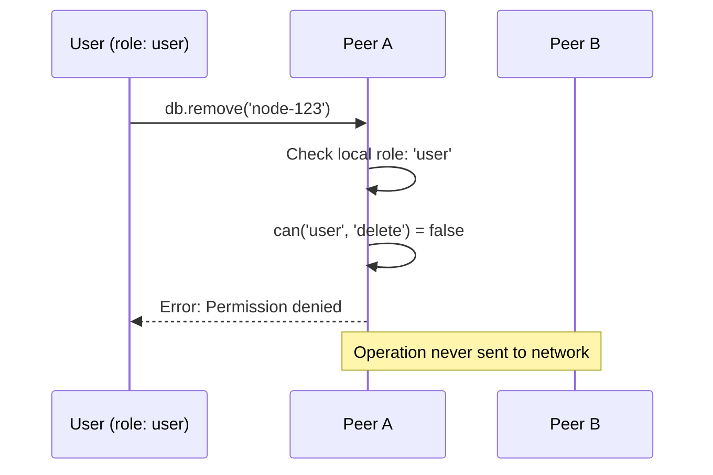
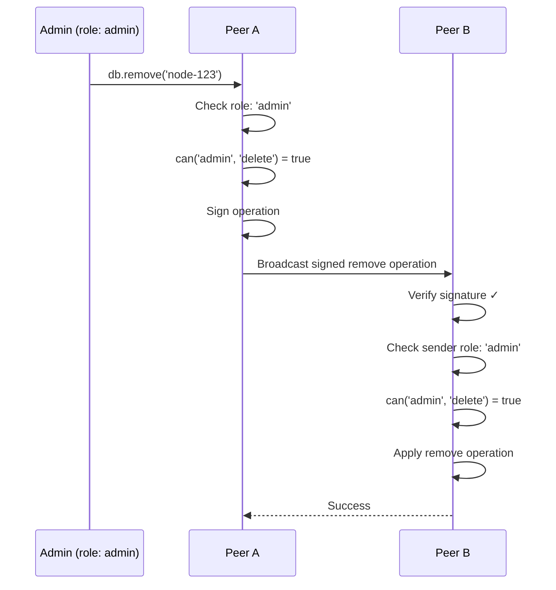

GenosDB's Security Manager implements a comprehensive Role-Based Access Control (RBAC) system that enforces granular permissions across the distributed network using cryptographic signatures and decentralized role storage.


## Overview

The RBAC system provides:

- **Customizable role hierarchy** (superadmin, admin, user, guest)
- **Granular permissions** (read, write, delete, link, sync, assignRole)
- **Cryptographic identity** tied to Ethereum addresses
- **Decentralized role storage** in the graph itself
- **Automatic enforcement** via middleware on all operations

## Architecture Components

### 1. Identity Management

Every user is identified by a cryptographic **Ethereum wallet**:

```javascript
const db = await gdb('mydb', {
  rtc: true,
  sm: {
    superAdmins: ['0x1234...', '0x5678...'] // Ethereum addresses
  }
});

const sm = db.sm; // Access Security Manager
```

**Identity Creation Methods:**

<Tabs>
  <Tab title="WebAuthn (Recommended)">
    ```javascript
    // Register new user with biometric/hardware key
    const result = await sm.startNewUserRegistration();
    // User creates mnemonic backup
    
    // Protect with WebAuthn
    await sm.protectCurrentIdentityWithWebAuthn();
    
    // Future logins use biometrics
    await sm.loginCurrentUserWithWebAuthn();
    ```
    
    <Info>
      WebAuthn provides passwordless, phishing-resistant security using biometrics or FIDO2 keys.
    </Info>
  </Tab>
  
  <Tab title="Mnemonic Phrase">
    ```javascript
    // Create new identity with mnemonic
    const { mnemonic, address } = await sm.startNewUserRegistration();
    // Save mnemonic securely (user responsibility)
    
    // Later recovery/login
    await sm.loginOrRecoverUserWithMnemonic(mnemonic);
    ```
    
    <Warning>
      Users must safely store their mnemonic phrase. Loss of mnemonic means permanent loss of identity.
    </Warning>
  </Tab>
</Tabs>

### 2. Role Hierarchy

Default role hierarchy (customizable):

```javascript
const DEFAULT_ROLES = {
  superadmin: {
    can: ['read', 'write', 'delete', 'link', 'sync', 'assignRole', 'publish']
  },
  admin: {
    can: ['read', 'write', 'delete', 'link', 'sync', 'publish']
  },
  manager: {
    can: ['read', 'write', 'link', 'sync', 'publish']
  },
  user: {
    can: ['read', 'write', 'link', 'sync']
  },
  guest: {
    can: ['read', 'sync']
  }
};
```

**Custom Roles:**

```javascript
const db = await gdb('mydb', {
  rtc: true,
  sm: {
    superAdmins: ['0x...'],
    customRoles: {
      moderator: {
        can: ['read', 'write', 'delete', 'sync'] // Can delete but not assign roles
      },
      viewer: {
        can: ['read'] // Read-only, no sync
      }
    }
  }
});
```

### 3. In-Graph Role Storage

Roles are stored as nodes within the GDB graph itself:

```javascript
// Role assignment creates a node
user:0x1234567890abcdef1234567890abcdef12345678
{
  role: 'admin',
  assignedBy: '0xabcdef...',
  assignedAt: 1709582400000,
  expiresAt: null  // optional expiration
}
```

<Info>
  Roles are **distributed** and **eventually consistent** like all data in GenosDB, enabling true decentralized access control.
</Info>

## Permission Enforcement

### Outgoing Operation Signing

When an authenticated user performs a database modification, the operation is automatically signed:

```javascript
// User writes data
await db.put({ title: 'My Note', content: 'Hello' });

// Behind the scenes, SM signs the operation
const signedOperation = {
  type: 'upsert',
  id: 'node-123',
  value: { title: 'My Note', content: 'Hello' },
  timestamp: { physical: 1709582400000, logical: 0 },
  signature: '0x...', // ECDSA signature
  originEthAddress: '0x1234...' // Sender's address
};
```

### Incoming Operation Verification

When a peer receives an operation, the SM performs critical checks:

<Steps>
  <Step title="Verify Signature">
    Cryptographically verify the signature matches the operation content and sender's address
    
    ```javascript
    const isValid = verifySignature(
      operationHash,
      operation.signature,
      operation.originEthAddress
    );
    
    if (!isValid) {
      // Discard invalid operation
      return;
    }
    ```
  </Step>
  
  <Step title="Resolve Permissions">
    Look up the sender's role in the local graph
    
    ```javascript
    const userNode = await db.get(`user:${operation.originEthAddress}`);
    const role = userNode?.value?.role || 'guest';
    ```
  </Step>
  
  <Step title="Authorize Action">
    Check if the role has permission for the requested action
    
    ```javascript
    const action = mapOperationToAction(operation.type);
    // operation.type 'upsert' -> action 'write'
    
    const hasPermission = can(role, action);
    
    if (!hasPermission) {
      // Silently filter out unauthorized operation
      return;
    }
    ```
  </Step>
  
  <Step title="Apply Operation">
    Only verified, authorized operations are applied to the local graph
    
    ```javascript
    // Safe to apply
    this.graph.set(operation.id, operation.value);
    ```
  </Step>
</Steps>

<Card title="Zero-Trust Enforcement" icon="shield-halved">
  Every peer independently enforces the network's rules. Invalid operations are silently filtered out, preventing unauthorized data from entering the local state.
</Card>

## Role Assignment

Only users with `assignRole` permission (typically superadmins) can change roles:

```javascript
// Check current user's role
const myRole = await sm.getCurrentUserRole();
console.log(myRole); // 'superadmin'

// Assign role to another user
if (myRole === 'superadmin') {
  await sm.assignRole(
    '0xnewuser...', // Target user's address
    'admin',         // New role
    null            // Optional expiration timestamp
  );
}
```

**What happens:**

1. Creates/updates `user:0xnewuser...` node with `role: 'admin'`
2. Signs the operation with superadmin's private key
3. Broadcasts to all peers
4. Peers verify signature and superadmin authority
5. Role update is applied across the network

## Permission Checks in Application Code

### Declarative Permission Check

```javascript
// Throws error if permission denied
try {
  await sm.executeWithPermission('delete');
  await db.remove(nodeId);
} catch (error) {
  console.error('Permission denied:', error.message);
}
```

### Manual Permission Check

```javascript
const userRole = await sm.getCurrentUserRole();

if (can(userRole, 'write')) {
  // User has write permission
  await db.put(data);
} else {
  // Show read-only UI
}
```

### Helper Function

```javascript
function can(role, action) {
  const roleConfig = ROLES[role];
  return roleConfig?.can.includes(action) || false;
}
```

## Security Flow Example

### Scenario: User Tries to Delete a Node



### Scenario: Admin Successfully Deletes Node



## Superadmin Authority

Superadmins have special authority:

**Static Source of Truth:**

```javascript
const db = await gdb('mydb', {
  sm: {
    superAdmins: ['0xALICE...', '0xBOB...'] // Immutable during runtime
  }
});
```

- Superadmin status is determined by the **static configuration**, not the graph
- Each peer independently validates superadmin actions against its local config
- Provides "root of trust" for the permission system

**Superadmin Recognition:**

```javascript
function getSenderRole(ethAddress) {
  // 1. Check static superadmin list FIRST
  if (this.config.superAdmins.includes(ethAddress)) {
    return 'superadmin';
  }
  
  // 2. Query distributed role from graph
  const userNode = this.graph.get(`user:${ethAddress}`);
  return userNode?.value?.role || 'guest';
}
```

<Info>
  This dual-source model ensures superadmins can operate immediately without waiting for network sync.
</Info>

## Access Control Lists (ACLs)

For node-level permissions beyond global RBAC, see the [ACLs Module](/modules/acls).

ACLs provide:

- **Per-node permissions** (read, write, delete)
- **Ownership model** (creator becomes owner)
- **Grant/revoke** permissions to specific users
- **Integrates with RBAC** (both checks must pass)

## Best Practices

<AccordionGroup>
  <Accordion title="Use WebAuthn for Production">
    WebAuthn provides the best security and UX:
    
    - Passwordless authentication
    - Phishing-resistant
    - Hardware-backed keys (TPM, Secure Enclave)
    - Biometric unlock (Face ID, Touch ID, Windows Hello)
    
    ```javascript
    // Enable WebAuthn after registration
    await sm.protectCurrentIdentityWithWebAuthn();
    ```
  </Accordion>
  
  <Accordion title="Design Minimal Privilege Roles">
    Follow principle of least privilege:
    
    ```javascript
    customRoles: {
      editor: {
        can: ['read', 'write', 'sync'] // Can't delete
      },
      viewer: {
        can: ['read'] // Read-only
      }
    }
    ```
  </Accordion>
  
  <Accordion title="Monitor Permission Denials">
    ```javascript
    db.on('permission:denied', ({ action, role, user }) => {
      console.warn(`Denied ${action} for ${role} (${user})`);
      // Log to analytics
    });
    ```
  </Accordion>
  
  <Accordion title="Use Role Expiration for Temporary Access">
    ```javascript
    const expiresIn7Days = Date.now() + (7 * 24 * 60 * 60 * 1000);
    
    await sm.assignRole(
      '0xtemporary...',
      'editor',
      expiresIn7Days
    );
    ```
    
    The system automatically downgrades to 'guest' after expiration.
  </Accordion>
</AccordionGroup>

## Related Pages

<CardGroup cols={2}>
  <Card title="WebAuthn Authentication" icon="fingerprint" href="/advanced/security/webauthn">
    Biometric and hardware-key authentication
  </Card>
  <Card title="Zero-Trust Model" icon="shield-check" href="/advanced/security/zero-trust">
    Security principles and trust model
  </Card>
  <Card title="Distributed Trust" icon="handshake" href="/advanced/security/distributed-trust">
    How trust works in a P2P network
  </Card>
</CardGroup>
