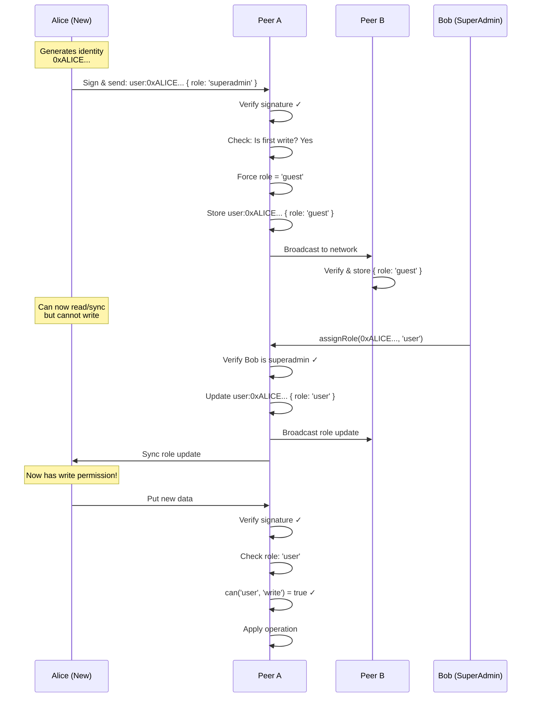

<iframe width="100%" height="400" src="https://www.youtube.com/embed/srSmcNLWMus" title="GenosDB: Zero-Trust Security Model" frameborder="0" allow="accelerometer; autoplay; clipboard-write; encrypted-media; gyroscope; picture-in-picture" allowfullscreen></iframe>

In a decentralized system, robust security isn't a feature—it's the foundation. GenosDB's Security Manager is built on a **"zero-trust with a single welcome exception"** principle. Every action must be cryptographically signed and explicitly authorized.

## Core Principle: Signed and Authorized

Before any operation is even considered, it must pass rigorous cryptographic checks:

<Steps>
  <Step title="Valid Signature">
    The operation must be signed by a valid Ethereum private key
  </Step>
  <Step title="Identity Match">
    The signature must correspond to the `originEthAddress` claimed in the message
  </Step>
  <Step title="Permission Check">
    The user's role must grant permission for the requested action
  </Step>
</Steps>

If these checks fail, the operation is immediately discarded. Only cryptographically verified operations proceed to the permission layer.

## The Bootstrap Problem

**Challenge**: How can a new user join the network if they need permission to announce their existence?

**Solution**: A single, highly-specific "welcome exception"

## Scenario 1: The Brand-New User (Guest)

A user whose Ethereum address has never been seen before (no `user:[eth_address]` node exists).

### The ONE Thing They CAN Do

New users are granted a **single welcome exception**:

<Card title="Bootstrap Permission" icon="door-open">
  A new user can perform **ONE** `write` operation to create their own user profile node.
</Card>

**Strict Rules:**

1. ✅ **Action MUST be `write`** (no other operation type allowed)
2. ✅ **Target MUST be their own node** (`id === "user:[their_eth_address]"`)
3. ✅ **User MUST NOT already exist** (one-time-only ticket)

**Security Enforcement:**

```javascript
// Even if user tries to set their own role
const incomingData = {
  role: 'superadmin', // Nice try!
  name: 'Alice'
};

// System forcefully overwrites role to 'guest'
const sanitizedData = {
  ...incomingData,
  role: 'guest' // Forced by system
};
```

<Warning>
  The system **ignores** any role claim in the first write and sets `role: "guest"` automatically, preventing self-privilege escalation.
</Warning>

### Everything They CANNOT Do

<AccordionGroup>
  <Accordion title="❌ Cannot choose their role">
    ```javascript
    // User attempts
    await db.put({
      id: 'user:0xALICE...',
      role: 'superadmin' // Ignored!
    });
    
    // System stores
    {
      id: 'user:0xALICE...',
      role: 'guest', // Forced
      ...otherData
    }
    ```
  </Accordion>
  
  <Accordion title="❌ Cannot write to any other node">
    ```javascript
    // DENIED
    await db.put({
      id: 'anything_else',
      value: 'data'
    });
    // Error: Permission denied
    ```
  </Accordion>
  
  <Accordion title="❌ Cannot delete anything">
    `'delete'` action not permitted for guest role
  </Accordion>
  
  <Accordion title="❌ Cannot link nodes">
    `'link'` action not permitted for guest role
  </Accordion>
</AccordionGroup>

## Scenario 2: Existing User with Guest Role

User has already created their `user:[address]` node with `role: "guest"`.

### What They CAN Do

<CardGroup cols={2}>
  <Card title="Read" icon="book-open">
    Can read public graph data
  </Card>
  <Card title="Sync" icon="arrows-rotate">
    Can participate in P2P synchronization to receive updates (including future role promotions)
  </Card>
</CardGroup>

### Everything They CANNOT Do

- ❌ **Cannot write anymore** — Bootstrap condition is now false; write access closed until promotion
- ❌ **Cannot delete, link, or assign roles** — Confined to minimal guest permissions

## Scenario 3: Promoted User (user, manager, admin)

User has been granted a higher role by a SuperAdmin.

### What They CAN Do

Exactly what their role (and inherited roles) allows:

| Role | Permissions |
|------|-------------|
| `user` | read, write, link, sync |
| `manager` | read, write, link, sync, publish |
| `admin` | read, write, link, sync, publish, delete |

```javascript
// User with 'admin' role
const role = await sm.getCurrentUserRole(); // 'admin'

if (can(role, 'delete')) {
  await db.remove('node-123'); // Allowed
}

if (can(role, 'assignRole')) {
  // Denied for admin (only superadmin)
  await sm.assignRole('0x...', 'user'); // Error
}
```

### Everything They CANNOT Do

- ❌ **Perform actions of a higher role** — An `admin` cannot `assignRole` (superadmin-only)
- ❌ **Forge another user's signature** — Can only act with their own identity

## Scenario 4: The SuperAdmin

User whose Ethereum address is hard-coded in the configuration.

```javascript
const db = await gdb('mydb', {
  rtc: true,
  sm: {
    superAdmins: ['0xALICE...', '0xBOB...'] // Root of trust
  }
});
```

### What They CAN Do

<Card title="Unlimited Authority" icon="crown">
  SuperAdmins have permission for **all** defined actions, including the critical `assignRole` permission that builds the permission hierarchy.
</Card>

```javascript
// Assign roles to users
await sm.assignRole('0xCHARLIE...', 'admin');
await sm.assignRole('0xDAVE...', 'user');

// Demote users
await sm.assignRole('0xEVE...', 'guest');

// Full CRUD access
await db.put({ type: 'announcement', text: 'New feature!' });
await db.remove('spam-node');
```

### Everything They CANNOT Do

- ❌ **Forge another user's signature** — Power resides in their own cryptographic identity; cannot act as others

## Permission Summary Table

| Action / Role | New Guest (First Write) | Existing Guest | User | Admin | SuperAdmin |
|:---|:---:|:---:|:---:|:---:|:---:|
| **Create Own User Node** | ✳️ Yes (One time) | ❌ No | (Exists) | (Exists) | (Exists) |
| **Write/Modify Data** | ❌ No (except above) | ❌ No | ✅ Yes | ✅ Yes | ✅ Yes |
| **Sync/Read Data** | ✅ Yes | ✅ Yes | ✅ Yes | ✅ Yes | ✅ Yes |
| **Link Nodes** | ❌ No | ❌ No | ✅ Yes | ✅ Yes | ✅ Yes |
| **Delete Nodes** | ❌ No | ❌ No | ❌ No | ✅ Yes | ✅ Yes |
| **Assign Roles** | ❌ No | ❌ No | ❌ No | ❌ No | ✅ **Yes** |

## Trust Flow Example

### New User Joins Network



## Security Guarantees

<CardGroup cols={2}>
  <Card title="No Self-Promotion" icon="user-slash">
    Users cannot grant themselves elevated privileges. Only superadmins can assign roles.
  </Card>
  <Card title="Cryptographic Proof" icon="key">
    Every operation requires a valid ECDSA signature. Forgery is computationally infeasible.
  </Card>
  <Card title="Independent Verification" icon="check-double">
    Each peer verifies all operations independently. Compromising one peer doesn't compromise the network.
  </Card>
  <Card title="Eventual Consistency" icon="rotate">
    Role updates propagate through the network using the same sync mechanism as data.
  </Card>
</CardGroup>

## Handling Malicious Behavior

### Attack: Eve tries to promote herself

```javascript
// Eve (role: guest) attempts
const maliciousOp = {
  type: 'upsert',
  id: 'user:0xEVE...',
  value: { role: 'admin' }, // Attempting promotion
  signature: signWithEvePrivateKey(...)
};

// Alice's node receives and verifies
function verifyOperation(op) {
  // 1. Verify signature
  if (!verifySignature(op)) return false;
  
  // 2. Get sender's role
  const senderRole = getSenderRole(op.originEthAddress);
  // senderRole = 'guest'
  
  // 3. Check if operation is role assignment
  if (op.id.startsWith('user:') && op.value.role) {
    // This is a role assignment, requires 'assignRole' permission
    if (!can(senderRole, 'assignRole')) {
      console.warn('Denied: Guest cannot assign roles');
      return false; // Silently reject
    }
  }
  
  return true;
}

// Result: Operation is rejected, Eve remains 'guest'
```

<Info>
  Unauthorized operations are **silently filtered out**. They never enter the local state, preventing malicious data propagation.
</Info>

### Attack: Eve modifies local client code

```javascript
// Eve modifies her local GenosDB client to skip permission checks
// Her node applies the role change locally

// However, when Eve tries to perform admin actions:
// 1. She signs the operation with her private key
// 2. Broadcasts to honest peers
// 3. Honest peers verify her signature (valid)
// 4. Honest peers check her role in THEIR graph (still 'guest')
// 5. Honest peers reject the operation

// Result: Eve's local state is corrupted, but the network is unaffected
```

<Card title="Distributed Defense" icon="shield-halved">
  Authority is granted through **verifiable means**, not claimed locally. Modifying local code doesn't grant network-wide permissions.
</Card>

## Best Practices for Secure Applications

1. **Initialize SuperAdmins Carefully**
   ```javascript
   const SUPERADMINS = [
     '0xALICE...', // Verified owner
     '0xBOB...'    // Verified co-owner
   ];
   
   const db = await gdb('mydb', {
     sm: { superAdmins: SUPERADMINS }
   });
   ```

2. **Use Role Hierarchy Thoughtfully**
   ```javascript
   customRoles: {
     moderator: {
       can: ['read', 'write', 'delete'] // Can delete spam
     },
     contributor: {
       can: ['read', 'write'] // Cannot delete
     }
   }
   ```

3. **Validate on Client AND Rely on Network**
   ```javascript
   // Client-side validation for UX
   const role = await sm.getCurrentUserRole();
   if (!can(role, 'delete')) {
     alert('You don\'t have permission to delete');
     return; // Don't even try
   }
   
   // Server/network validation happens automatically
   await db.remove(nodeId);
   ```

4. **Monitor Permission Denials**
   ```javascript
   // Track attempted unauthorized actions
   db.on('permission:denied', ({ user, action, role }) => {
     console.warn(`Denied ${action} for ${role} (${user})`);
     // Send to analytics/security monitoring
   });
   ```

## Related Pages

<CardGroup cols={2}>
  <Card title="RBAC" icon="users-gear" href="/advanced/security/rbac">
    Detailed RBAC implementation
  </Card>
  <Card title="Distributed Trust" icon="handshake" href="/advanced/security/distributed-trust">
    How trust works without a central authority
  </Card>
  <Card title="WebAuthn" icon="fingerprint" href="/advanced/security/webauthn">
    Biometric authentication details
  </Card>
</CardGroup>
