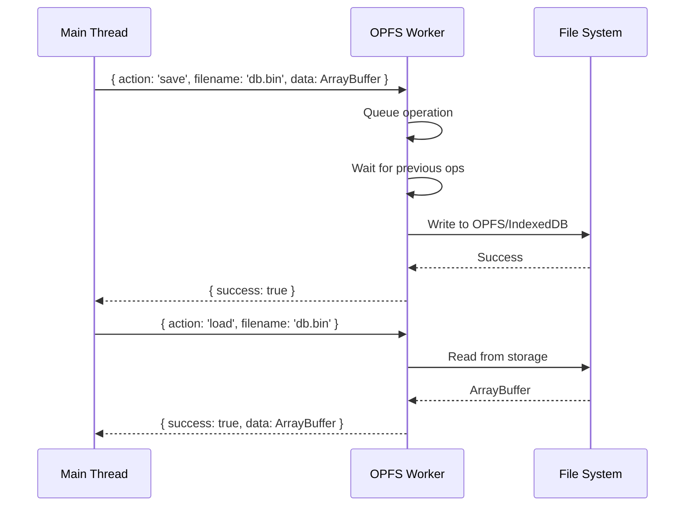

The GenosDB persistence layer is managed by a dedicated Web Worker designed for high-performance, reliable, and non-blocking file I/O. This component ensures all data persistence operations are handled efficiently without compromising the responsiveness of the main application thread.

## Overview

The OPFS (Origin Private File System) Worker is fundamental to GenosDB's architecture, providing:

- **Non-blocking I/O**: All persistence happens on a background thread
- **Tiered storage**: Automatic fallback from OPFS → IndexedDB
- **Data integrity**: Serialized access control prevents corruption
- **Resource safety**: Guaranteed cleanup even on errors


## Core Architectural Pillars

### 1. Dynamic Storage Strategy with Tiered Fallback

The worker employs an intelligent, tiered approach to data storage, automatically selecting the most performant API available in the user's browser at runtime.

<Steps>
  <Step title="Synchronous OPFS (Preferred)">
    Leverages `createSyncAccessHandle` API for lowest latency file I/O with direct, block-level access
  </Step>
  <Step title="Asynchronous OPFS (Fallback)">
    Uses `createWritable` stream-based API for modern browsers without sync support
  </Step>
  <Step title="IndexedDB (Universal)">
    Final fallback ensuring GenosDB works on all browsers
  </Step>
</Steps>

```javascript
// Simplified storage selection logic
async function selectStorageStrategy() {
  if (await supportsSyncOPFS()) {
    return new SyncOPFSAdapter();
  } else if (await supportsAsyncOPFS()) {
    return new AsyncOPFSAdapter();
  } else {
    return new IndexedDBAdapter();
  }
}
```

<Info>
  This dynamic strategy allows GenosDB to capitalize on cutting-edge browser features while maintaining universal compatibility.
</Info>

### 2. Serialized Access Control for Data Integrity

To prevent data corruption from concurrent write operations, the worker implements a sophisticated access control mechanism.

**Per-File Asynchronous Queue**

- Each file maintains a promise-based queue
- Every `save` request is appended to the queue for its target file
- Operations execute strictly one after another

```javascript
// Per-file queue implementation
const fileQueues = new Map();

function enqueueOperation(filename, operation) {
  if (!fileQueues.has(filename)) {
    fileQueues.set(filename, Promise.resolve());
  }
  
  const queue = fileQueues.get(filename);
  const nextOp = queue.then(() => operation());
  fileQueues.set(filename, nextOp);
  
  return nextOp;
}
```

<Warning>
  This mechanism is crucial for GenosDB's reliability. It eliminates race conditions that could arise from rapid local mutations and incoming real-time updates from peers.
</Warning>

### 3. Resilient and Leak-Proof Resource Management

Robustness is built into the worker's design to handle unexpected failures gracefully.

**Guaranteed Resource Cleanup**

All interactions with OPFS file handles and writable streams are enclosed within `try...finally` blocks:

```javascript
async function saveToOPFS(filename, data) {
  let handle = null;
  try {
    const root = await navigator.storage.getDirectory();
    const fileHandle = await root.getFileHandle(filename, { create: true });
    handle = await fileHandle.createSyncAccessHandle();
    
    // Write operations
    handle.truncate(0);
    handle.write(data);
    handle.flush();
    
  } finally {
    // ALWAYS close, even on error
    if (handle) {
      handle.close();
    }
  }
}
```

**Specific Error Propagation**

The worker distinguishes between error types:

- "File not found" errors for missing data
- I/O exceptions for system errors
- Permission errors for storage quota issues

This allows the main GenosDB instance to handle different failure scenarios appropriately.

### 4. True Asynchronous, Non-Blocking I/O

By operating entirely within a Web Worker, all file system interactions occur on a separate background thread.

<Card title="Performance Benefit" icon="gauge-high">
  Intensive operations like serializing and persisting a large graph state will never block or freeze the main UI thread. Applications remain fluid and responsive at all times.
</Card>

## Worker Communication Protocol

The main thread and worker communicate via message passing:



### Message Format

**Save Operation**
```javascript
// Main thread sends
worker.postMessage({
  action: 'save',
  filename: 'mydb.bin',
  data: uint8Array.buffer // Transferable
}, [uint8Array.buffer]);

// Worker responds
postMessage({ success: true });
```

**Load Operation**
```javascript
// Main thread sends
worker.postMessage({
  action: 'load',
  filename: 'mydb.bin'
});

// Worker responds
postMessage({ 
  success: true, 
  data: arrayBuffer 
}, [arrayBuffer]);
```

<Note>
  Using **Transferable Objects** (ArrayBuffers) eliminates data copying overhead, dramatically improving performance for large databases.
</Note>

## Role within the GenosDB Ecosystem

The persistence worker is not just a technical convenience—it's an enabler of GenosDB's core capabilities:

### Performance at Scale

- Synchronous OPFS enables rapid persistence of compressed binary state
- Handles large datasets and high-frequency updates with minimal impact
- Tested with 100K+ nodes without performance degradation

### Unyielding Data Consistency

- Serialized access control ensures on-disk state is never corrupted
- Provides reliable foundation for offline access
- Enables cross-tab synchronization via BroadcastChannel

### Superior User Experience

- Offloading storage tasks prevents UI stutter
- Users experience no freezes while data saves in background
- Essential for collaborative and data-intensive applications

### Developer-Friendly Abstraction

The worker exposes a simple, promise-based API:

```javascript
// Clean abstraction hides complexity
await worker.save('mydb.bin', serializedData);
const data = await worker.load('mydb.bin');
```

This allows core database logic to focus on data management rather than storage intricacies.

## Cross-Tab Data Integrity

In version 0.11.8, a critical enhancement was made to prevent race conditions when multiple tabs write simultaneously.

### The Problem

Without coordination:

1. Tab A starts writing to `mydb.bin`
2. Tab B starts writing to `mydb.bin` at the same time
3. File becomes corrupted with interleaved data

### The Solution: Web Locks API

```javascript
async function saveWithLock(filename, data) {
  await navigator.locks.request(`file:${filename}`, async () => {
    // Only one tab can execute this at a time
    await performWrite(filename, data);
  });
}
```

<Info>
  The Web Locks API ensures all write operations to a given file are serialized across tabs, guaranteeing data consistency.
</Info>

## Performance Characteristics

| Operation | Sync OPFS | Async OPFS | IndexedDB |
|-----------|-----------|------------|----------|
| Write (10KB) | ~2ms | ~5ms | ~10ms |
| Write (100KB) | ~5ms | ~15ms | ~30ms |
| Write (1MB) | ~20ms | ~50ms | ~100ms |
| Read (10KB) | ~1ms | ~3ms | ~8ms |
| Read (100KB) | ~3ms | ~10ms | ~25ms |
| Read (1MB) | ~15ms | ~40ms | ~90ms |

<Note>
  Performance varies based on hardware, browser, and system load. All operations are debounced (default 300ms) to batch rapid writes.
</Note>

## Configuration Options

You can configure the worker's behavior during initialization:

```javascript
const db = await gdb('mydb', {
  saveDelay: 0,      // Immediate persistence (use for critical data)
  // saveDelay: 300, // Default: debounce for 300ms
  // saveDelay: 1000 // Longer delay for better batching
});
```

**When to use different delays:**

- `saveDelay: 0` - Critical data that must persist immediately
- `saveDelay: 300` - Balanced performance (default)
- `saveDelay: 1000+` - High-throughput scenarios with acceptable data loss window

## Related Pages

<CardGroup cols={2}>
  <Card title="Architecture Overview" icon="sitemap" href="/advanced/architecture-overview">
    See how the worker fits into the overall system
  </Card>
  <Card title="Hybrid Delta Protocol" icon="code-merge" href="/advanced/hybrid-delta-protocol">
    How synchronized data gets persisted
  </Card>
</CardGroup>
