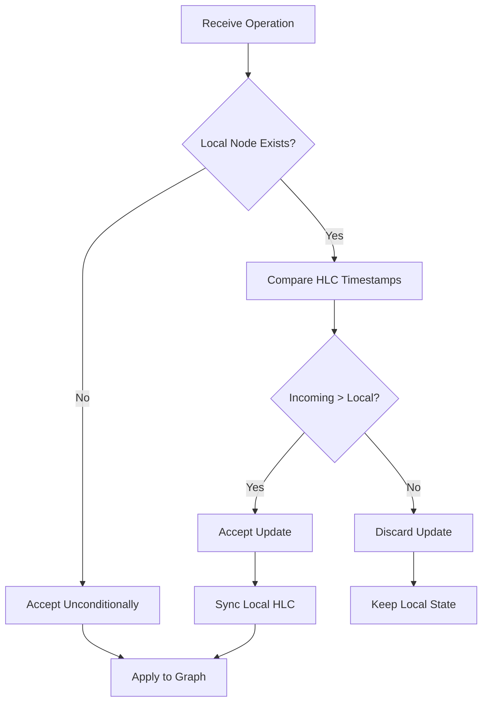

## Overview

In a distributed peer-to-peer system, multiple users can modify the same data simultaneously. GenosDB's conflict resolution system ensures data consistency and integrity across all peers using a **Last-Write-Wins (LWW)** strategy enhanced by **Hybrid Logical Clocks (HLC)**.

<Info>
Conflict resolution happens automatically and transparently. Developers don't need to manually handle conflicts in most cases.
</Info>

## The Challenge of Distributed Conflicts

Consider this scenario:

```javascript
// Peer A (offline) updates a user profile
await db.put({ name: 'Alice', status: 'busy' }, 'user123')

// Peer B (offline) updates the same profile
await db.put({ name: 'Alice', status: 'available' }, 'user123')

// Both peers come online and sync - which version wins?
```

Without a central server to serialize writes, we need a deterministic way to resolve such conflicts.

## Hybrid Logical Clock (HLC)

The foundation of GenosDB's conflict resolution is the **Hybrid Logical Clock**, which combines physical time with logical counters to create causally-ordered timestamps.

### HLC Components

<CardGroup cols={2}>
  <Card title="Physical Component" icon="clock">
    **Wall-clock time** from the system's local clock, keeping timestamps aligned with real-world time.
    
    Used for primary ordering of events.
  </Card>
  
  <Card title="Logical Component" icon="list-ol">
    **Sequential counter** that acts as a tie-breaker for events occurring within the same millisecond.
    
    Preserves "happens-before" causality.
  </Card>
</CardGroup>

### HLC Structure

```javascript
{
  physical: 1709587200000,  // Unix timestamp in milliseconds
  logical: 5                // Logical counter for same-millisecond events
}
```

## How HLC Timestamps Work

### Local Timestamp Generation

When a local operation occurs (e.g., `put`, `remove`, `link`):

<Steps>
  <Step title="Ensure Monotonicity">
    The physical component is set to the maximum of:
    - Current system time
    - Previous timestamp's physical time
    
    This ensures time never moves backward, even if the system clock is adjusted.
  </Step>
  
  <Step title="Increment Logical Counter">
    If the physical time matches the previous timestamp, increment the logical counter.
    
    Otherwise, reset the logical counter to 0.
  </Step>
  
  <Step title="Assign to Operation">
    The new HLC timestamp is assigned to the operation and stored with the node.
  </Step>
</Steps>

```javascript
// Example: Rapid successive operations
await db.put({ value: 1 }, 'node1')  // { physical: 1000, logical: 0 }
await db.put({ value: 2 }, 'node2')  // { physical: 1000, logical: 1 }
await db.put({ value: 3 }, 'node3')  // { physical: 1000, logical: 2 }
```

### Clock Synchronization with Remote Events

When a node receives data from a peer:

<Steps>
  <Step title="Inspect Remote Timestamp">
    Extract the HLC timestamp from the incoming operation.
  </Step>
  
  <Step title="Advance Physical Component">
    Update local clock's physical time to the maximum of:
    - Current local time
    - Remote timestamp's physical time
  </Step>
  
  <Step title="Update Logical Component">
    Adjust the logical counter to ensure the next local timestamp will be causally after the remote event.
  </Step>
</Steps>

<Info>
This synchronization protocol propagates causal information through the network, ensuring all peers converge toward a consistent view of event ordering.
</Info>

## Last-Write-Wins (LWW) Resolution

When concurrent updates to the same node are detected, GenosDB uses LWW with HLC timestamps to resolve the conflict deterministically.

### Timestamp Comparison Logic

Two HLC timestamps are compared using **lexicographical ordering**:

<Steps>
  <Step title="Compare Physical Components">
    The timestamp with the **greater physical value wins**.
    
    ```javascript
    timestampA = { physical: 1000, logical: 5 }
    timestampB = { physical: 1001, logical: 0 }
    
    // timestampB wins (1001 > 1000)
    ```
  </Step>
  
  <Step title="Compare Logical Components (if physical tied)">
    If physical components are equal, the timestamp with the **greater logical value wins**.
    
    ```javascript
    timestampA = { physical: 1000, logical: 5 }
    timestampB = { physical: 1000, logical: 3 }
    
    // timestampA wins (5 > 3)
    ```
  </Step>
</Steps>

### Resolution Process

When an incoming update targets existing local data:

<Steps>
  <Step title="Validate Timestamp">
    Check for unreasonably future timestamps (clock skew protection).
  </Step>
  
  <Step title="Compare Timestamps">
    Use lexicographical comparison:
    
    ```javascript
    if (incoming.timestamp > local.timestamp) {
      // Incoming wins - accept update
    } else {
      // Local wins - discard incoming
    }
    ```
  </Step>
  
  <Step title="Apply or Discard">
    - **Incoming wins**: Overwrite local data, sync local clock
    - **Local wins**: Discard incoming update, keep local data
  </Step>
</Steps>

## Clock Skew Protection

Misconfigured system clocks can disrupt distributed ordering. GenosDB implements safeguards:

### Future Drift Limit

Timestamps unreasonably far in the future are **capped** at a maximum acceptable drift (default: 2 hours):

```javascript
const MAX_FUTURE_DRIFT = 2 * 60 * 60 * 1000  // 2 hours in milliseconds

if (incoming.physical > currentTime + MAX_FUTURE_DRIFT) {
  // Cap the physical component
  incoming.physical = currentTime + MAX_FUTURE_DRIFT
  // Preserve logical component for ordering
}
```

<Warning>
This prevents a single misconfigured peer from corrupting the temporal ordering of the entire system.
</Warning>

## Conflict Resolution Examples

### Example 1: Concurrent Updates from Different Peers

```javascript
// Initial state: { name: 'Alice', age: 30 }
// Node ID: 'user123'
// Timestamp: { physical: 1000, logical: 0 }

// === Peer A (offline) ===
await db.put({ name: 'Alice', age: 31 }, 'user123')
// Local timestamp: { physical: 2000, logical: 0 }

// === Peer B (offline) ===
await db.put({ name: 'Alice', age: 32 }, 'user123')
// Local timestamp: { physical: 1500, logical: 0 }

// === Peers come online and sync ===
// Peer A's update wins (2000 > 1500)
// Final state on both peers: { name: 'Alice', age: 31 }
```

### Example 2: Rapid Same-Millisecond Updates

```javascript
// Single peer making rapid updates

await db.put({ count: 1 }, 'counter')
// Timestamp: { physical: 5000, logical: 0 }

await db.put({ count: 2 }, 'counter')
// Timestamp: { physical: 5000, logical: 1 }

await db.put({ count: 3 }, 'counter')
// Timestamp: { physical: 5000, logical: 2 }

// Logical counter ensures correct ordering
// Final state: { count: 3 }
```

### Example 3: Clock Skew Scenario

```javascript
// Peer A has correct time: 10:00:00 AM
// Peer B has clock set to: 10:00:00 PM (12 hours ahead)

// Peer B creates update
await db.put({ status: 'future' }, 'node1')
// Timestamp: { physical: 1709630400000, logical: 0 }  // 10 PM

// Peer A receives the update
// GenosDB caps the timestamp to MAX_FUTURE_DRIFT
// Adjusted timestamp: { physical: 1709587200000, logical: 0 }  // 12 PM (2hr drift)

// System remains stable despite clock skew
```

## Integration with P2P Sync

Conflict resolution is seamlessly integrated into the synchronization pipeline:

<Steps>
  <Step title="Receive Operation">
    Peer receives a `put` or `link` operation from the network.
  </Step>
  
  <Step title="Extract Timestamp">
    Extract the HLC timestamp from the operation.
  </Step>
  
  <Step title="Resolve Conflict">
    Compare with local node's timestamp (if exists).
  </Step>
  
  <Step title="Apply or Discard">
    If incoming wins, update the graph **and** sync the local HLC.
  </Step>
  
  <Step title="Maintain Causality">
    Clock synchronization ensures future local operations are causally after this event.
  </Step>
</Steps>



## Custom Conflict Resolution

For advanced use cases, you can provide a custom conflict resolver:

```javascript
const db = await gdb('my-app', {
  rtc: true,
  resolveConflict: (localNode, remoteNode) => {
    // Custom logic: merge values instead of replacing
    return {
      ...localNode.value,
      ...remoteNode.value,
      // Keep the later timestamp
      _timestamp: remoteNode.timestamp > localNode.timestamp 
        ? remoteNode.timestamp 
        : localNode.timestamp
    }
  }
})
```

<Warning>
Custom conflict resolvers must maintain commutativity (order-independent results) and idempotency (same result when applied multiple times) to ensure eventual consistency.
</Warning>

## Eventual Consistency Guarantees

GenosDB provides **strong eventual consistency**:

<CardGroup cols={2}>
  <Card title="Determinism" icon="equals">
    All peers resolve conflicts identically, guaranteeing convergence to the same state.
  </Card>
  
  <Card title="Causality Preservation" icon="arrow-right">
    If operation A happens before operation B, A's effects are visible before B's at every peer.
  </Card>
  
  <Card title="Progress" icon="forward">
    The system always makes forward progress, even during network partitions.
  </Card>
  
  <Card title="Convergence" icon="code-merge">
    Once all operations have propagated, all peers have identical state.
  </Card>
</CardGroup>

## Limitations and Trade-offs

### Last-Write-Wins Trade-offs

<Warning>
**Data Loss**: LWW can discard concurrent updates. If two users edit different fields simultaneously, one user's changes may be lost.
</Warning>

```javascript
// Initial: { name: 'Alice', age: 30, city: 'NYC' }

// User A updates age (timestamp: 1000)
await db.put({ name: 'Alice', age: 31, city: 'NYC' }, 'user1')

// User B updates city (timestamp: 999)
await db.put({ name: 'Alice', age: 30, city: 'SF' }, 'user1')

// Result: User A's entire update wins
// Final: { name: 'Alice', age: 31, city: 'NYC' }
// User B's city change is lost!
```

**Solution**: Design your data model with granular nodes:

```javascript
// Better: Separate nodes for each attribute
await db.put({ age: 31 }, 'user1:age')
await db.put({ city: 'SF' }, 'user1:city')

// Now both updates can coexist
```

### Clock Dependency

HLC relies on reasonably synchronized physical clocks:

- **Best Case**: Clocks within seconds of each other
- **Acceptable**: Clocks within the drift limit (2 hours)
- **Problematic**: Clocks beyond drift limit may cause unexpected ordering

<Tip>
Most modern devices sync with NTP servers, making clock skew rare in practice.
</Tip>

## Best Practices

### 1. Granular Data Modeling

```javascript
// ❌ Avoid: Large objects with multiple fields
await db.put({
  name: 'Alice',
  age: 30,
  email: 'alice@example.com',
  bio: 'Software engineer',
  preferences: { theme: 'dark', lang: 'en' }
}, 'user1')

// ✅ Better: Split into focused nodes
await db.put({ name: 'Alice' }, 'user1:profile:name')
await db.put({ age: 30 }, 'user1:profile:age')
await db.put({ email: 'alice@example.com' }, 'user1:profile:email')
await db.put({ bio: 'Software engineer' }, 'user1:profile:bio')
await db.put({ theme: 'dark', lang: 'en' }, 'user1:preferences')
```

### 2. Understand LWW Semantics

LWW is ideal for:
- User profiles
- Configuration settings
- Status updates
- Non-critical collaborative data

Avoid LWW for:
- Financial transactions (use append-only logs)
- Inventory counts (use CRDTs like counters)
- Collaborative text editing (use OT or CRDTs)

### 3. Design for Idempotency

```javascript
// ✅ Idempotent: Same result if applied multiple times
await db.put({ status: 'active' }, 'user1:status')

// ❌ Non-idempotent: Result depends on order and frequency
await db.put({ count: currentCount + 1 }, 'counter')
```

### 4. Monitor Clock Skew

While GenosDB handles skew gracefully, monitoring can help:

```javascript
// Check a node's timestamp
const { result } = await db.get('node1')
const nodeTime = result.timestamp.physical
const localTime = Date.now()

if (Math.abs(nodeTime - localTime) > 60000) {
  console.warn('Significant clock skew detected:', nodeTime - localTime, 'ms')
}
```

## Related Resources

<CardGroup cols={2}>
  <Card title="P2P Sync" icon="network-wired" href="/concepts/p2p-sync">
    Understand how conflicts are detected during synchronization
  </Card>
  
  <Card title="CRUD Operations" icon="database" href="/guides/crud-operations">
    Learn how put and remove operations generate timestamps
  </Card>
  
  <Card title="Real-Time Subscriptions" icon="bell" href="/guides/real-time-subscriptions">
    See how conflict resolution affects live query results
  </Card>
  
  <Card title="Todo App Example" icon="list-check" href="/examples/todo-app">
    See conflict resolution in action with a practical example
  </Card>
</CardGroup>
