## Overview

GenosDB's synchronization engine is designed to handle the reality of distributed networks where peers can have vastly different states. The system intelligently switches between two modes—high-efficiency delta updates and guaranteed full-state fallback—to ensure eventual consistency with optimal performance.

## How P2P Sync Works

GenosDB uses a **hybrid synchronization protocol** that combines real-time delta updates with a full-state fallback mechanism. This dual-mode architecture offers the performance of delta-syncing with the absolute reliability of full-state reconciliation.

<Info>
P2P networking is enabled by initializing the database with `{ rtc: true }`. The database name serves as the room identifier for peer discovery.
</Info>

### Peer Discovery with Nostr

GenosDB uses the **Nostr protocol** for decentralized peer discovery and WebRTC signaling:

- **Decentralized Relays**: Nostr relays facilitate peer discovery without centralized servers
- **WebRTC Signaling**: SDP offers and ICE candidates are exchanged through Nostr messages
- **Room-Based Scoping**: The database name serves as the room ID for grouping peers
- **End-to-End Encryption**: All signaling messages are cryptographically secured

```javascript
import { gdb } from 'genosdb'

// Enable P2P with default Nostr relays
const db = await gdb('my-app', { rtc: true })

// Use custom Nostr relays
const db = await gdb('my-app', {
  rtc: {
    relayUrls: [
      'wss://relay1.example.com',
      'wss://relay2.example.com'
    ]
  }
})
```

<Note>
Find public and private Nostr relays at [nostr.watch/relays/find](https://legacy.nostr.watch/relays/find)
</Note>

### WebRTC Connections

Once peers discover each other via Nostr, they establish direct **WebRTC connections** for data transfer:

- **Direct Peer-to-Peer**: Data flows directly between browsers without intermediary servers
- **NAT Traversal**: TURN servers can be configured for peers behind restrictive firewalls
- **Data Channels**: Named channels carry database operations and custom application data
- **Media Streams**: Audio and video can be shared alongside data

```javascript
// Configure TURN servers for NAT traversal
const db = await gdb('my-app', {
  rtc: {
    turnConfig: [
      {
        urls: ['turn:your-turn-server.com:3478'],
        username: 'user',
        credential: 'password'
      }
    ]
  }
})
```

## Delta Sync: High-Efficiency Updates

For peers that are frequently communicating, transmitting the entire graph for minor changes would be inefficient. GenosDB's primary synchronization method uses **delta updates** powered by a persistent **Operation Log (Oplog)**.

### How Delta Sync Works

<Steps>
  <Step title="Operation Logging">
    Every local mutation (`put`, `remove`, `link`) is recorded in a capped, sliding-window log persisted in localStorage. Each entry contains:
    
    - Operation type (`upsert`, `remove`, `link`)
    - Affected node ID
    - Hybrid Logical Clock (HLC) timestamp for causal ordering
  </Step>
  
  <Step title="Sync Handshake">
    When a peer connects or needs to catch up, it broadcasts a `sync` request containing the HLC timestamp of the last operation it processed (`globalTimestamp`).
    
    A brand-new peer with no history sends `globalTimestamp: null`.
  </Step>
  
  <Step title="Delta Calculation">
    Upon receiving a sync request, a peer:
    
    1. Consults its Oplog
    2. Filters operations with timestamps greater than the requesting peer's `globalTimestamp`
    3. **Hydrates** `upsert` operations by fetching full node values from the graph
    4. Creates a self-contained delta set
  </Step>
  
  <Step title="Compressed Transfer">
    The delta array is:
    
    - Serialized using **MessagePack** for compact binary format
    - Compressed with **pako (deflate)** for minimal bandwidth
    - Sent in a `deltaSync` message over WebRTC data channel
  </Step>
  
  <Step title="Application">
    The receiving peer decompresses and applies the batch of operations, rapidly synchronizing its graph state.
  </Step>
</Steps>

### Oplog Configuration

```javascript
const db = await gdb('my-app', {
  rtc: true,
  oplogSize: 100  // Keep last 100 operations (default: 20)
})
```

<Warning>
Larger oplog sizes allow peers to sync after longer disconnections but consume more memory. The default of 20 operations balances efficiency with memory usage.
</Warning>

## Full-State Fallback: Guaranteed Consistency

A delta update is only possible if a peer's history overlaps with the Oplog of its peers. GenosDB gracefully handles scenarios where this isn't the case by automatically triggering a **Full-State Fallback**.

### Fallback Triggers

Full-state sync is initiated when:

1. **Out-of-Range Timestamp**: A peer's `globalTimestamp` is older than the oldest operation in the Oplog
2. **New Peer**: A peer sends `globalTimestamp: null`, indicating no previous state

### The Fallback Process

<Steps>
  <Step title="Full-State Transmission">
    The up-to-date peer serializes and compresses its **entire current graph state** and sends it in a `syncReceive` message.
  </Step>
  
  <Step title="State Reconciliation">
    The desynchronized peer:
    
    - Discards its outdated local graph state
    - Replaces it with the new full state
    - Clears its own Oplog (previous history is now invalid)
  </Step>
  
  <Step title="Clock Fast-Forward">
    The peer scans the newly received graph to find the **highest HLC timestamp** among all nodes, then:
    
    - Updates its own `HybridClock` to this value
    - Sets its `globalTimestamp` to this value
    - Can now immediately participate in future delta syncs from a known-good state
  </Step>
</Steps>

<Tip>
This dual-mode architecture ensures **eventual consistency** across the network regardless of peer connectivity patterns.
</Tip>

## Synchronization Modes Compared

<CardGroup cols={2}>
  <Card title="Delta Sync" icon="bolt">
    **Best For:** Active peers with overlapping history
    
    **Pros:**
    - Minimal bandwidth usage
    - Near-instant updates
    - Efficient for frequent changes
    
    **Cons:**
    - Requires overlapping Oplog history
    - Limited by oplogSize window
  </Card>
  
  <Card title="Full-State Fallback" icon="arrows-rotate">
    **Best For:** New peers or long-disconnected clients
    
    **Pros:**
    - Guaranteed consistency
    - Works for any state difference
    - Resets peer to known-good state
    
    **Cons:**
    - Larger initial transfer
    - Discards local conflicting state
  </Card>
</CardGroup>

## Cross-Tab Synchronization

In addition to P2P sync between devices, GenosDB synchronizes instantly between **browser tabs** on the same machine using `BroadcastChannel`:

```javascript
// Changes in one tab are immediately reflected in all other tabs
const db = await gdb('my-app')

// Tab A
await db.put({ name: 'Alice' }, 'user1')

// Tab B receives the update instantly via BroadcastChannel
```

<Info>
Cross-tab sync works even without `rtc: true` enabled, providing local-first synchronization within a single browser.
</Info>

## Data Pipeline

Here's how data flows through GenosDB's sync pipeline:

```mermaid
graph LR
    A[Local Operation] --> B[Oplog Entry]
    B --> C[MessagePack Serialization]
    C --> D[Pako Compression]
    D --> E[WebRTC Data Channel]
    E --> F[Remote Peer]
    F --> G[Decompression]
    G --> H[Deserialization]
    H --> I[Conflict Resolution]
    I --> J[Apply to Graph]
```



## Cellular Mesh for Large-Scale Networks

For applications with **100+ concurrent peers**, GenosDB offers a **Cellular Mesh** topology that reduces connection complexity from O(N²) to O(N):

```javascript
const db = await gdb('large-event', {
  rtc: { 
    cells: true  // Enable cellular mesh with defaults
  }
})

// Custom cell configuration
const db = await gdb('massive-app', {
  rtc: {
    cells: {
      cellSize: 'auto',       // Auto-calculate based on network size
      bridgesPerEdge: 2,      // Redundant bridges between cells
      maxCellSize: 50,        // Maximum peers per cell
      targetCells: 100,       // Target number of cells
      debug: false            // Enable debug logging
    }
  }
})
```

<CardGroup cols={2}>
  <Card title="Standard Mesh" icon="network-wired">
    **Recommended for:** < 50 peers
    
    - Full mesh topology
    - Single-hop message delivery
    - Lower latency
    - O(N²) connections
  </Card>
  
  <Card title="Cellular Mesh" icon="grid">
    **Recommended for:** 100+ peers
    
    - Organized into cells with bridges
    - Multi-hop message routing
    - Slight latency increase
    - O(N) connections
  </Card>
</CardGroup>

<Note>
Learn more about Cellular Mesh architecture in the [P2P Setup Guide](/guides/p2p-setup#cellular-mesh-configuration).
</Note>

## Best Practices

### Optimize Oplog Size

```javascript
// For apps with frequent reconnections
const db = await gdb('my-app', {
  rtc: true,
  oplogSize: 50  // Keep more history for better delta sync coverage
})

// For memory-constrained environments
const db = await gdb('my-app', {
  rtc: true,
  oplogSize: 10  // Minimal oplog, rely more on full-state fallback
})
```

### Handle Peer Events

```javascript
const db = await gdb('my-app', { rtc: true })

// Listen for peer connections
db.room.on('peer:join', (peerId) => {
  console.log(`Peer ${peerId} joined`)
})

db.room.on('peer:leave', (peerId) => {
  console.log(`Peer ${peerId} left`)
})
```

### Monitor Sync Status

While GenosDB doesn't expose a direct "sync status" API, you can monitor peer connections:

```javascript
const db = await gdb('my-app', { rtc: true })

let peerCount = 0

db.room.on('peer:join', () => {
  peerCount++
  console.log(`Connected peers: ${peerCount}`)
})

db.room.on('peer:leave', () => {
  peerCount--
  console.log(`Connected peers: ${peerCount}`)
})
```

## Related Resources

<CardGroup cols={2}>
  <Card title="P2P Setup Guide" icon="network-wired" href="/guides/p2p-setup">
    Configure relays, TURN servers, and cellular mesh
  </Card>
  
  <Card title="Conflict Resolution" icon="code-merge" href="/concepts/conflict-resolution">
    Learn how GenosDB resolves concurrent updates
  </Card>
  
  <Card title="Security Model" icon="shield" href="/concepts/security-model">
    Understand RBAC and cryptographic verification
  </Card>
  
  <Card title="Real-Time Subscriptions" icon="bell" href="/guides/real-time-subscriptions">
    Set up reactive queries with live updates
  </Card>
</CardGroup>
