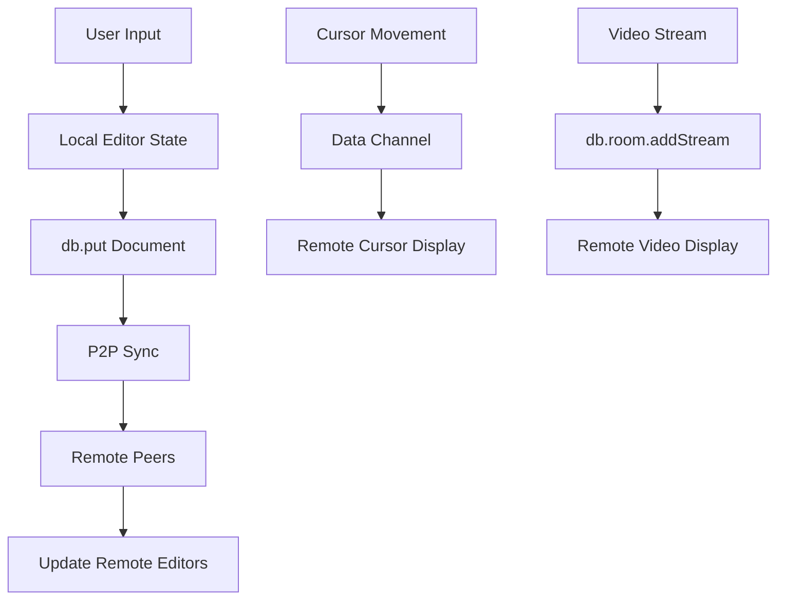

## Overview

This advanced example demonstrates building a production-ready collaborative editor with:

- **Real-time typing sync** across all peers
- **Remote cursor positions** and selections
- **Markdown/HTML split preview** with draggable splitter
- **Version history** with restore functionality
- **File sharing** via P2P
- **Integrated video room** for face-to-face collaboration
- **RBAC + WebAuthn** for secure authentication
- **Rich text toolbar** with formatting options

<Tip>
View the [live demo](https://estebanrfp.github.io/gdb/examples/collab.html) to see all features in action.
</Tip>

## Architecture Overview

The collaborative editor combines multiple GenosDB features:



## Core Concepts

### 1. Document Synchronization

The editor uses a single document node that all peers subscribe to:

```javascript
const DOCUMENT_ID = 'doc:main'

// Subscribe to document changes
await db.get(
  DOCUMENT_ID,
  (doc) => {
    if (doc && doc.value.content !== editor.value) {
      // Update local editor if remote change
      editor.value = doc.value.content
    }
  }
)

// Save changes on input (debounced)
let saveTimeout
editor.addEventListener('input', () => {
  clearTimeout(saveTimeout)
  saveTimeout = setTimeout(async () => {
    await db.put({
      content: editor.value,
      updatedAt: Date.now(),
      updatedBy: currentUser
    }, DOCUMENT_ID)
  }, 300)  // 300ms debounce
})
```

<Warning>
**Conflict Resolution**: GenosDB uses Last-Write-Wins (LWW). For high-frequency concurrent edits, consider operational transformation (OT) or CRDTs for character-level merging.
</Warning>

### 2. Remote Cursor Positions

Cursors use **data channels** for ephemeral updates:

```javascript
const cursorChannel = db.room.channel('cursors')
const remoteCursors = new Map()

// Send cursor position
editor.addEventListener('selectionchange', () => {
  const { selectionStart, selectionEnd } = editor
  cursorChannel.send({
    username: currentUser,
    start: selectionStart,
    end: selectionEnd
  })
})

// Receive remote cursors
cursorChannel.on('message', ({ username, start, end }, peerId) => {
  updateCursorDisplay(peerId, username, start, end)
})
```

### 3. Version History

Save snapshots with timestamps:

```javascript
const versions = []

async function saveVersion() {
  const versionId = await db.put({
    type: 'version',
    content: editor.value,
    timestamp: Date.now(),
    author: currentUser
  })
  
  versions.unshift({
    id: versionId,
    timestamp: Date.now(),
    preview: editor.value.slice(0, 100)
  })
  
  updateVersionList()
}

async function restoreVersion(versionId) {
  const { result: version } = await db.get(versionId)
  if (!version) return
  
  editor.value = version.value.content
  await db.put({
    content: version.value.content,
    updatedAt: Date.now(),
    updatedBy: currentUser
  }, DOCUMENT_ID)
}
```

### 4. Video Integration

Add video chat alongside the editor:

```javascript
const videoContainer = document.getElementById('videos')
const peerVideos = new Map()

// Start local video
async function startVideo() {
  const stream = await navigator.mediaDevices.getUserMedia({
    video: true,
    audio: true
  })
  
  // Display local video
  const localVideo = document.createElement('video')
  localVideo.srcObject = stream
  localVideo.autoplay = true
  localVideo.muted = true  // Mute own audio
  videoContainer.appendChild(localVideo)
  
  // Broadcast to peers
  db.room.addStream(stream)
}

// Receive remote videos
db.room.on('stream:add', (stream, peerId) => {
  const video = document.createElement('video')
  video.srcObject = stream
  video.autoplay = true
  video.playsInline = true
  video.dataset.peer = peerId
  videoContainer.appendChild(video)
  peerVideos.set(peerId, video)
})

db.room.on('peer:leave', (peerId) => {
  const video = peerVideos.get(peerId)
  if (video) {
    video.remove()
    peerVideos.delete(peerId)
  }
})
```

## Complete Implementation

Here's a simplified but complete collaborative editor:

```html
<!DOCTYPE html>
<html lang="en">
<head>
  <meta charset="UTF-8">
  <meta name="viewport" content="width=device-width, initial-scale=1.0">
  <title>Collaborative Editor</title>
  <style>
    * {
      margin: 0;
      padding: 0;
      box-sizing: border-box;
    }
    
    body {
      font-family: -apple-system, BlinkMacSystemFont, 'Segoe UI', Roboto, sans-serif;
      display: flex;
      flex-direction: column;
      height: 100vh;
      background: #0b1220;
      color: #e5e7eb;
    }
    
    header {
      background: #1a1a1a;
      padding: 1rem;
      border-bottom: 1px solid #333;
    }
    
    #toolbar {
      background: #1a1a1a;
      padding: 0.5rem;
      display: flex;
      gap: 0.5rem;
      border-bottom: 1px solid #333;
    }
    
    button {
      padding: 0.5rem 1rem;
      background: #0ea5e9;
      border: none;
      color: white;
      border-radius: 4px;
      cursor: pointer;
    }
    
    button:hover {
      background: #0284c7;
    }
    
    #editor-container {
      flex: 1;
      display: flex;
      overflow: hidden;
    }
    
    #editor {
      flex: 1;
      padding: 1rem;
      background: #1e293b;
      color: #e5e7eb;
      border: none;
      font-family: 'Monaco', 'Courier New', monospace;
      font-size: 14px;
      line-height: 1.6;
      resize: none;
    }
    
    #editor:focus {
      outline: none;
    }
    
    #preview {
      flex: 1;
      padding: 1rem;
      background: #0f172a;
      overflow-y: auto;
      border-left: 1px solid #333;
    }
    
    #videos {
      position: fixed;
      bottom: 20px;
      right: 20px;
      display: flex;
      gap: 10px;
      z-index: 1000;
    }
    
    #videos video {
      width: 200px;
      height: 150px;
      border-radius: 8px;
      border: 2px solid #0ea5e9;
    }
    
    .cursor-overlay {
      position: absolute;
      width: 2px;
      background: var(--cursor-color);
      pointer-events: none;
      z-index: 10;
    }
    
    .cursor-label {
      position: absolute;
      background: var(--cursor-color);
      color: white;
      padding: 2px 6px;
      border-radius: 3px;
      font-size: 12px;
      white-space: nowrap;
    }
  </style>
</head>
<body>
  <header>
    <h1>Collaborative Editor</h1>
  </header>
  
  <div id="toolbar">
    <button onclick="saveVersion()">Save Version</button>
    <button onclick="togglePreview()">Toggle Preview</button>
    <button onclick="startVideo()">Start Video</button>
    <button onclick="shareFile()">Share File</button>
  </div>
  
  <div id="editor-container">
    <textarea id="editor" placeholder="Start typing..."></textarea>
    <div id="preview" style="display: none;"></div>
  </div>
  
  <div id="videos"></div>
  
  <script type="module">
    import { gdb } from 'https://cdn.jsdelivr.net/npm/genosdb@latest/dist/index.min.js'
    import { marked } from 'https://cdn.jsdelivr.net/npm/marked@latest/lib/marked.esm.js'
    
    const DOCUMENT_ID = 'doc:main'
    const editor = document.getElementById('editor')
    const preview = document.getElementById('preview')
    const videoContainer = document.getElementById('videos')
    
    let currentUser = localStorage.getItem('username') || prompt('Enter your name:')
    localStorage.setItem('username', currentUser)
    
    // Initialize GenosDB
    const db = await gdb('collab-editor', { rtc: true })
    
    // === Document Synchronization ===
    
    let isRemoteUpdate = false
    
    await db.get(DOCUMENT_ID, (doc) => {
      if (doc && doc.value.content !== editor.value) {
        isRemoteUpdate = true
        editor.value = doc.value.content
        updatePreview()
      }
    })
    
    let saveTimeout
    editor.addEventListener('input', () => {
      updatePreview()
      
      if (isRemoteUpdate) {
        isRemoteUpdate = false
        return
      }
      
      clearTimeout(saveTimeout)
      saveTimeout = setTimeout(async () => {
        await db.put({
          content: editor.value,
          updatedAt: Date.now(),
          updatedBy: currentUser
        }, DOCUMENT_ID)
      }, 300)
    })
    
    // === Preview ===
    
    function updatePreview() {
      preview.innerHTML = marked(editor.value)
    }
    
    window.togglePreview = function() {
      const isVisible = preview.style.display !== 'none'
      preview.style.display = isVisible ? 'none' : 'block'
    }
    
    // === Remote Cursors ===
    
    const cursorChannel = db.room.channel('cursors')
    const remoteCursors = new Map()
    const colors = ['#ef4444', '#3b82f6', '#10b981', '#f59e0b', '#8b5cf6']
    let colorIndex = 0
    
    editor.addEventListener('click', sendCursorPosition)
    editor.addEventListener('keyup', sendCursorPosition)
    
    function sendCursorPosition() {
      cursorChannel.send({
        username: currentUser,
        position: editor.selectionStart
      })
    }
    
    cursorChannel.on('message', ({ username, position }, peerId) => {
      if (!remoteCursors.has(peerId)) {
        remoteCursors.set(peerId, {
          username,
          color: colors[colorIndex++ % colors.length]
        })
      }
      // In production, calculate pixel position and display cursor
    })
    
    // === Video Chat ===
    
    const peerVideos = new Map()
    
    window.startVideo = async function() {
      try {
        const stream = await navigator.mediaDevices.getUserMedia({
          video: true,
          audio: true
        })
        
        const localVideo = document.createElement('video')
        localVideo.srcObject = stream
        localVideo.autoplay = true
        localVideo.muted = true
        localVideo.playsInline = true
        videoContainer.appendChild(localVideo)
        
        db.room.addStream(stream)
      } catch (err) {
        alert('Camera access denied: ' + err.message)
      }
    }
    
    db.room.on('stream:add', (stream, peerId) => {
      const video = document.createElement('video')
      video.srcObject = stream
      video.autoplay = true
      video.playsInline = true
      video.dataset.peer = peerId
      videoContainer.appendChild(video)
      peerVideos.set(peerId, video)
    })
    
    db.room.on('peer:leave', (peerId) => {
      const video = peerVideos.get(peerId)
      if (video) {
        video.remove()
        peerVideos.delete(peerId)
      }
    })
    
    // === Version History ===
    
    window.saveVersion = async function() {
      const versionId = await db.put({
        type: 'version',
        content: editor.value,
        timestamp: Date.now(),
        author: currentUser
      })
      alert('Version saved!')
    }
    
    // === File Sharing ===
    
    const fileChannel = db.room.channel('files')
    
    window.shareFile = async function() {
      const input = document.createElement('input')
      input.type = 'file'
      input.onchange = async (e) => {
        const file = e.target.files[0]
        if (!file) return
        
        const buffer = await file.arrayBuffer()
        fileChannel.send({
          name: file.name,
          type: file.type,
          data: buffer
        })
        alert('File shared!')
      }
      input.click()
    }
    
    fileChannel.on('message', ({ name, type, data }) => {
      const blob = new Blob([data], { type })
      const url = URL.createObjectURL(blob)
      const a = document.createElement('a')
      a.href = url
      a.download = name
      a.click()
      URL.revokeObjectURL(url)
      alert(`Received file: ${name}`)
    })
  </script>
</body>
</html>
```

## Advanced Features

### Security with WebAuthn

```javascript
const db = await gdb('secure-editor', {
  rtc: true,
  sm: {
    superAdmins: ['0x1234...'],
    customRoles: {
      editor: { can: ['write'], inherits: ['guest'] },
      viewer: { can: ['read'], inherits: ['guest'] }
    }
  }
})

// Require login
await db.sm.loginCurrentUserWithWebAuthn()

// Only editors can save
if (await db.sm.executeWithPermission('write')) {
  await db.put({ content: editor.value }, DOCUMENT_ID)
}
```

### Presence Indicators

```javascript
const presenceChannel = db.room.channel('presence')
const onlineUsers = new Set()

// Broadcast presence
setInterval(() => {
  presenceChannel.send({ username: currentUser, active: true })
}, 3000)

// Track users
presenceChannel.on('message', ({ username }, peerId) => {
  onlineUsers.add(username)
  updateUserList()
})

db.room.on('peer:leave', (peerId) => {
  // Remove user from list
})
```

### Conflict Indicators

Show when multiple users edit simultaneously:

```javascript
let lastRemoteUpdate = 0

await db.get(DOCUMENT_ID, (doc) => {
  if (doc) {
    const timeSinceEdit = Date.now() - lastRemoteUpdate
    if (timeSinceEdit < 2000 && doc.value.updatedBy !== currentUser) {
      showConflictWarning(doc.value.updatedBy)
    }
    lastRemoteUpdate = Date.now()
  }
})
```

## Key Learnings

<CardGroup cols={2}>
  <Card title="Debounce Saves" icon="clock">
    Use setTimeout to batch rapid keystrokes into single database writes.
  </Card>
  
  <Card title="Data Channels for Ephemeral" icon="paper-plane">
    Cursor positions don't need persistence. Use channels instead of put().
  </Card>
  
  <Card title="Version Snapshots" icon="camera">
    Periodic snapshots enable time travel and conflict recovery.
  </Card>
  
  <Card title="LWW Limitations" icon="triangle-exclamation">
    Last-Write-Wins can lose concurrent edits. Consider OT/CRDTs for character-level sync.
  </Card>
</CardGroup>

## Performance Optimization

### Chunked Documents

For large documents, split into chunks:

```javascript
// Split into paragraphs
const paragraphs = editor.value.split('\n\n')

for (let i = 0; i < paragraphs.length; i++) {
  await db.put({
    type: 'paragraph',
    docId: DOCUMENT_ID,
    index: i,
    content: paragraphs[i]
  }, `${DOCUMENT_ID}:p${i}`)
}
```

### Lazy Loading

Load version history on demand:

```javascript
async function loadVersionHistory() {
  const { results } = await db.map({
    query: { type: 'version' },
    field: 'timestamp',
    order: 'desc',
    $limit: 20  // Last 20 versions
  })
  displayVersions(results)
}
```

## Next Steps

<CardGroup cols={2}>
  <Card title="Security Model" icon="shield" href="/concepts/security-model">
    Add RBAC and WebAuthn authentication
  </Card>
  
  <Card title="P2P Setup" icon="network-wired" href="/guides/p2p-setup">
    Configure for production with TURN servers
  </Card>
  
  <Card title="Real-Time Subscriptions" icon="bell" href="/guides/real-time-subscriptions">
    Master reactive patterns
  </Card>
  
  <Card title="Examples Overview" icon="grid" href="/examples/overview">
    Explore more GenosDB examples
  </Card>
</CardGroup>
