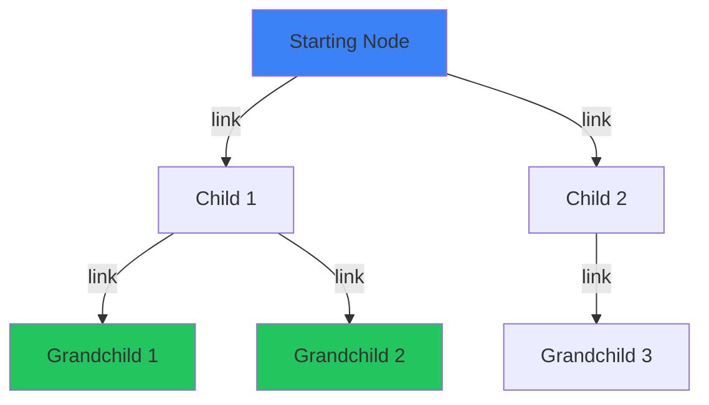

## Overview

The `$edge` operator is one of GenosDB's most powerful features. It transforms standard queries into **graph exploration tools**, allowing you to traverse entire relationship trees in a single declarative query.

<Info>
Graph traversal uses the `link` relationships you create between nodes to discover connected data at any depth.
</Info>

## How `$edge` Works

A query with `$edge` has two logical parts:

<Steps>
  <Step title="Find Starting Points">
    The main query conditions identify the node(s) from which traversal begins.
  </Step>
  
  <Step title="Traverse and Filter Descendants">
    The `$edge` sub-query is applied to **every descendant node** found by following links recursively.
  </Step>
  
  <Step title="Return Matching Descendants">
    The final result contains only the descendant nodes that match the `$edge` criteria, not the starting nodes.
  </Step>
</Steps>



## Basic Syntax

```javascript
const { results } = await db.map({
  query: {
    // 1. Conditions to find starting node(s)
    type: 'folder',
    name: 'Documents',
    
    // 2. Traverse from starting nodes
    $edge: {
      // 3. Filter for descendants matching this sub-query
      type: 'file',
      extension: 'pdf'
    }
  }
})

// results contains only the PDF files found under Documents
```

## Simple Traversal Example

### Setting Up the Graph

```javascript
import { gdb } from 'genosdb'

const db = await gdb('file-system')

// Create folders
await db.put({ type: 'folder', name: 'Documents' }, 'folder:docs')
await db.put({ type: 'folder', name: 'Work' }, 'folder:work')
await db.put({ type: 'folder', name: 'Personal' }, 'folder:personal')

// Create files
await db.put({ type: 'file', name: 'report.pdf', size: 1024 }, 'file:report')
await db.put({ type: 'file', name: 'notes.txt', size: 512 }, 'file:notes')
await db.put({ type: 'file', name: 'photo.jpg', size: 2048 }, 'file:photo')

// Create folder hierarchy
await db.link('folder:docs', 'folder:work')      // docs -> work
await db.link('folder:docs', 'folder:personal')  // docs -> personal
await db.link('folder:work', 'file:report')      // work -> report.pdf
await db.link('folder:work', 'file:notes')       // work -> notes.txt
await db.link('folder:personal', 'file:photo')   // personal -> photo.jpg
```

### Traversing the Graph

```javascript
// Find all files under Documents (regardless of depth)
const { results } = await db.map({
  query: {
    type: 'folder',
    name: 'Documents',
    $edge: {
      type: 'file'  // Only return files
    }
  }
})

console.log(results)
// [
//   { id: 'file:report', value: { type: 'file', name: 'report.pdf', ... } },
//   { id: 'file:notes', value: { type: 'file', name: 'notes.txt', ... } },
//   { id: 'file:photo', value: { type: 'file', name: 'photo.jpg', ... } }
// ]
```

<Tip>
The starting node (`folder:docs`) is **not** included in the results. Only the descendants that match the `$edge` filter are returned.
</Tip>

## Advanced Traversal Examples

### Filtering Descendants

```javascript
// Find only large PDF files under Documents
const { results } = await db.map({
  query: {
    type: 'folder',
    name: 'Documents',
    $edge: {
      type: 'file',
      extension: 'pdf',
      size: { $gt: 1000 }  // Larger than 1000 bytes
    }
  }
})
```

### Multiple Starting Points

```javascript
// Find files in any folder named "Archive"
const { results } = await db.map({
  query: {
    type: 'folder',
    name: { $like: '%Archive%' },  // Matches any folder with "Archive" in name
    $edge: {
      type: 'file'
    }
  }
})
```

### Complex Descendant Filters

```javascript
// Find images or videos in the Media folder
const { results } = await db.map({
  query: {
    type: 'folder',
    name: 'Media',
    $edge: {
      type: 'file',
      $or: [
        { extension: { $in: ['jpg', 'png', 'gif'] } },  // Images
        { extension: { $in: ['mp4', 'avi', 'mov'] } }   // Videos
      ]
    }
  }
})
```

## Social Network Example

### Building a Social Graph

```javascript
const db = await gdb('social-network')

// Create users
await db.put({ type: 'user', name: 'Alice', age: 30 }, 'user:alice')
await db.put({ type: 'user', name: 'Bob', age: 25 }, 'user:bob')
await db.put({ type: 'user', name: 'Charlie', age: 35 }, 'user:charlie')
await db.put({ type: 'user', name: 'Diana', age: 28 }, 'user:diana')
await db.put({ type: 'user', name: 'Eve', age: 22 }, 'user:eve')

// Create posts
await db.put({ type: 'post', content: 'Hello world!', likes: 10 }, 'post:1')
await db.put({ type: 'post', content: 'GenosDB is great', likes: 25 }, 'post:2')
await db.put({ type: 'post', content: 'Learning graphs', likes: 5 }, 'post:3')

// Create connections
await db.link('user:alice', 'user:bob')      // Alice -> Bob (friend)
await db.link('user:alice', 'user:charlie')  // Alice -> Charlie (friend)
await db.link('user:bob', 'user:diana')      // Bob -> Diana (friend)
await db.link('user:charlie', 'user:eve')    // Charlie -> Eve (friend)

// Link users to their posts
await db.link('user:alice', 'post:1')
await db.link('user:bob', 'post:2')
await db.link('user:diana', 'post:3')
```

### Finding Friends' Posts

```javascript
// Find all posts by Alice's friends (direct and indirect)
const { results } = await db.map({
  query: {
    type: 'user',
    name: 'Alice',
    $edge: {
      type: 'post'  // Traverse to any connected posts
    }
  }
})

console.log(results)
// Returns post:1, post:2, post:3 (posts by Alice, Bob, and Diana)
```

### Finding Friends-of-Friends

```javascript
// Find all people in Alice's extended network
const { results } = await db.map({
  query: {
    type: 'user',
    name: 'Alice',
    $edge: {
      type: 'user'  // Traverse to connected users
    }
  }
})

console.log(results.map(r => r.value.name))
// ['Bob', 'Charlie', 'Diana', 'Eve'] (all reachable users)
```

### Filtered Network Traversal

```javascript
// Find adult friends (age >= 18) in Alice's network
const { results } = await db.map({
  query: {
    type: 'user',
    name: 'Alice',
    $edge: {
      type: 'user',
      age: { $gte: 25 }  // Only users 25 or older
    }
  }
})

console.log(results.map(r => r.value.name))
// ['Bob', 'Charlie', 'Diana'] (Eve is 22, filtered out)
```

## Organization Hierarchy Example

```javascript
// Create organization structure
await db.put({ type: 'company', name: 'TechCorp' }, 'company:tech')
await db.put({ type: 'department', name: 'Engineering' }, 'dept:eng')
await db.put({ type: 'department', name: 'Design' }, 'dept:design')
await db.put({ type: 'team', name: 'Backend', budget: 50000 }, 'team:backend')
await db.put({ type: 'team', name: 'Frontend', budget: 45000 }, 'team:frontend')
await db.put({ type: 'team', name: 'UX', budget: 30000 }, 'team:ux')
await db.put({ type: 'team', name: 'UI', budget: 28000 }, 'team:ui')

// Build hierarchy
await db.link('company:tech', 'dept:eng')
await db.link('company:tech', 'dept:design')
await db.link('dept:eng', 'team:backend')
await db.link('dept:eng', 'team:frontend')
await db.link('dept:design', 'team:ux')
await db.link('dept:design', 'team:ui')

// Find all well-funded teams in the company
const { results } = await db.map({
  query: {
    type: 'company',
    name: 'TechCorp',
    $edge: {
      type: 'team',
      budget: { $gte: 40000 }  // Teams with >= 40k budget
    }
  }
})

console.log(results.map(r => r.value.name))
// ['Backend', 'Frontend'] (UX and UI teams filtered out)
```

## Combining `$edge` with Other Operators

### With Logical Operators

```javascript
// Find PDFs or large images in Documents
const { results } = await db.map({
  query: {
    type: 'folder',
    name: 'Documents',
    $edge: {
      type: 'file',
      $or: [
        { extension: 'pdf' },
        {
          $and: [
            { extension: { $in: ['jpg', 'png'] } },
            { size: { $gt: 1000000 } }  // > 1MB
          ]
        }
      ]
    }
  }
})
```

### With Text Search

```javascript
// Find documents containing "report" in Alice's folders
const { results } = await db.map({
  query: {
    type: 'user',
    name: 'Alice',
    $edge: {
      type: 'file',
      name: { $text: 'report' }
    }
  }
})
```

### With Sorting and Pagination

```javascript
// Find recent posts from Alice's network, sorted by likes
const { results } = await db.map({
  query: {
    type: 'user',
    name: 'Alice',
    $edge: {
      type: 'post',
      createdAt: { $gt: lastWeek }
    }
  },
  field: 'likes',    // Sort by likes
  order: 'desc',     // Highest first
  $limit: 10         // Top 10
})
```

## Real-Time Graph Traversal

Make graph queries reactive:

```javascript
const { results, unsubscribe } = await db.map(
  {
    query: {
      type: 'user',
      name: 'Alice',
      $edge: {
        type: 'post'
      }
    }
  },
  ({ id, value, action }) => {
    if (action === 'added') {
      console.log('New post in network:', value)
    } else if (action === 'removed') {
      console.log('Post removed:', id)
    }
  }
)

// Initial posts
console.log('Initial posts:', results)

// Later: cleanup
unsubscribe()
```

<Info>
Reactive graph queries update when:
- New links are created
- Linked nodes are updated
- Linked nodes are deleted
</Info>

## Performance Considerations

### Traversal Depth

By default, `$edge` traverses the **entire descendant tree** with no depth limit:

```javascript
// Traverses all levels: children, grandchildren, great-grandchildren, etc.
const { results } = await db.map({
  query: {
    id: 'root',
    $edge: { type: 'file' }
  }
})
```

<Warning>
Deep or cyclic graphs can cause performance issues. Design your graph structure carefully and use specific filters in the `$edge` sub-query.
</Warning>

### Optimize with Specific Filters

```javascript
// ❌ Slow: Traverses everything then filters
const { results } = await db.map({
  query: {
    type: 'folder',
    $edge: {}  // No filter - traverses all descendants
  }
})

// ✅ Fast: Filters during traversal
const { results } = await db.map({
  query: {
    type: 'folder',
    $edge: {
      type: 'file',         // Only traverse to files
      extension: 'pdf'      // Further filter
    }
  }
})
```

### Limit Results

Always use `$limit` for large graphs:

```javascript
const { results } = await db.map({
  query: {
    type: 'user',
    name: 'Alice',
    $edge: { type: 'post' }
  },
  $limit: 20  // Return at most 20 posts
})
```

## Common Patterns

### Find All Leaf Nodes

```javascript
// Find files (leaf nodes) under a folder
const { results } = await db.map({
  query: {
    type: 'folder',
    name: 'Root',
    $edge: {
      type: 'file'  // Files are leaf nodes (no outgoing links)
    }
  }
})
```

### Path Validation

```javascript
// Check if a specific file is accessible from a folder
const { results } = await db.map({
  query: {
    type: 'folder',
    name: 'Shared',
    $edge: {
      id: 'file:secret.pdf'  // Does this specific file exist in the tree?
    }
  }
})

const isAccessible = results.length > 0
```

### Dependency Resolution

```javascript
// Find all dependencies of a package
await db.put({ type: 'package', name: 'react' }, 'pkg:react')
await db.put({ type: 'package', name: 'react-dom' }, 'pkg:react-dom')
await db.put({ type: 'package', name: 'scheduler' }, 'pkg:scheduler')

await db.link('pkg:react', 'pkg:react-dom')
await db.link('pkg:react-dom', 'pkg:scheduler')

const { results } = await db.map({
  query: {
    type: 'package',
    name: 'react',
    $edge: {
      type: 'package'  // All dependencies (direct and transitive)
    }
  }
})

console.log('Dependencies:', results.map(r => r.value.name))
// ['react-dom', 'scheduler']
```

## Bidirectional Traversal

GenosDB's `$edge` only follows **outgoing links**. For bidirectional traversal, create links in both directions:

```javascript
// Create bidirectional friendship
await db.link('user:alice', 'user:bob')  // Alice -> Bob
await db.link('user:bob', 'user:alice')  // Bob -> Alice

// Now both can traverse to each other
const aliceFriends = await db.map({
  query: {
    type: 'user',
    name: 'Alice',
    $edge: { type: 'user' }
  }
})

const bobFriends = await db.map({
  query: {
    type: 'user',
    name: 'Bob',
    $edge: { type: 'user' }
  }
})
```

## Debugging Graph Queries

```javascript
// Inspect the graph structure
const { result: node } = await db.get('folder:docs')
console.log('Outgoing links:', node.edges)

// Find all nodes linking to a specific node (reverse lookup)
const { results: incomingLinks } = await db.map({
  query: {}  // All nodes
})

const pointingToFile = incomingLinks.filter(n => 
  n.edges.includes('file:report')
)
console.log('Nodes pointing to file:report:', pointingToFile)
```

## Related Resources

<CardGroup cols={2}>
  <Card title="Queries" icon="magnifying-glass" href="/guides/queries">
    Learn query operators to use in $edge filters
  </Card>
  
  <Card title="CRUD Operations" icon="database" href="/guides/crud-operations">
    Understand how to create links with the link method
  </Card>
  
  <Card title="Real-Time Subscriptions" icon="bell" href="/guides/real-time-subscriptions">
    Make graph queries reactive
  </Card>
  
  <Card title="Collaborative Editor" icon="users" href="/examples/collaborative-editor">
    See graph traversal in a complex application
  </Card>
</CardGroup>
